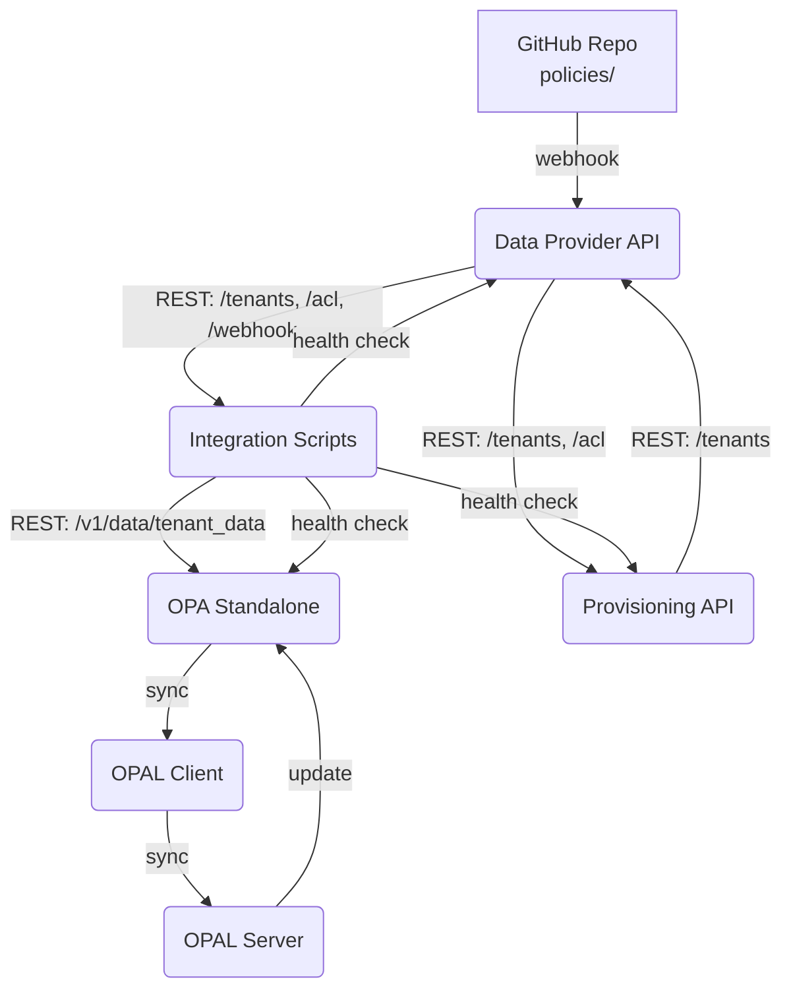

# OPA Zero Poll

**OPA Zero Poll** to nowoczesny system zarządzania politykami RBAC i autoryzacją, oparty na OPA, z integracją OPAL. Architektura oparta o mikroserwisy, integrację przez REST i webhooki GitHub.

---

## 🎯 Założenia projektu (Proof of Concept)

Ten projekt jest **Proof of Concept (POC)**, który ma za zadanie **pokazać realizowalność** docelowej architektury systemu autoryzacji dla aplikacji enterprise. 

### Architektura docelowa


Docelowy system ma obsługiwać:
- **Wiele aplikacji klienckich** korzystających z centralnej autoryzacji
- **Dynamiczne zarządzanie politykami** przez administratorów
- **Skalowalne rozwiązanie** dla dużej liczby użytkowników i tenantów
- **Real-time aktualizacje** polityk bez restartowania aplikacji

### Rola komponentów w architekturze docelowej

#### 🏢 **Data Provider API** (Port 8110)
**Cel**: Symuluje **Enterprise Data Source** z diagramu docelowego
- Dostarcza dane użytkowników, ról i uprawnień dla każdego tenanta
- Odbiera webhooki GitHub o zmianach w politykach
- W docelowym systemie zostanie zastąpiony przez prawdziwe systemy HR/ERP/CRM

#### ⚙️ **Provisioning API** (Port 8010) 
**Cel**: Symuluje **Tenant Management System** z diagramu docelowego
- Zarządza cyklem życia tenantów (dodawanie, usuwanie, konfiguracja)
- W docelowym systemie będzie zintegrowany z systemami onboardingu klientów

#### 🔄 **Integration Scripts** (Port 8000)
**Cel**: Implementuje **Data Synchronization Layer** z diagramu docelowego
- Orkiestruje przepływ danych między systemami
- Zapewnia transformację danych do formatu wymaganego przez OPA
- Obsługuje health checks i monitoring

#### 🛡️ **OPA + OPAL**
**Cel**: Stanowią rdzeń **Policy Decision Point (PDP)** z diagramu docelowego
- **OPA Standalone**: Silnik decyzyjny autoryzacji
- **OPAL Server**: Zarządzanie politykami i ich dystrybucja
- **OPAL Client**: Synchronizacja polityk w czasie rzeczywistym

### 📋 Co dowodzi ten POC?

1. **✅ Integracja mikroserwisów** - wszystkie komponenty komunikują się przez REST API
2. **✅ Real-time updates** - zmiany w politykach są automatycznie propagowane przez OPAL
3. **✅ Tenant isolation** - każdy tenant ma odrębne dane i polityki  
4. **✅ GitHub-based policy management** - polityki są zarządzane jako kod
5. **✅ Health monitoring** - każdy komponent eksponuje endpointy health check
6. **✅ Skalowalna architektura** - komponenty mogą być niezależnie skalowane

---

## Architektura POC



- **Data Provider API** (Flask, port 8110) – dostarcza dane ACL dla tenantów, odbiera webhooki GitHub
- **Provisioning API** (Flask, port 8010) – zarządzanie tenantami
- **OPA Standalone** (port 8181) – silnik autoryzacji z politykami Rego
- **Integration Scripts** – synchronizacja danych i polityk, obsługa webhooków
- **OPAL Client** – synchronizuje dane z OPAL Server
- **OPAL Server** – zarządza politykami i synchronizacją z OPA

---

## Szybki start

1. **Klonuj repozytorium**
   ```sh
   git clone https://github.com/plduser/opa-zero-poll.git
   cd opa-zero-poll
   ```

2. **Uruchom wszystkie serwisy**
   ```sh
   docker-compose up --build -d
   ```

3. **Sprawdź health check**
   ```sh
   curl http://localhost:8110/health
   ```

4. **Dodaj webhook GitHub**
   - Skonfiguruj webhook na adres: `http://localhost:8110/webhook/policy-update` (lub przez ngrok)
   - Ustaw `WEBHOOK_SECRET` w pliku `.env` lub w zmiennych środowiskowych Dockera

5. **Testuj integrację**
   - Zrób commit i push zmiany w polityce w katalogu `policies/`
   - Sprawdź logi Data Provider API i OPA

---

## Dokumentacja

- [docs/ARCHITECTURE.md](docs/ARCHITECTURE.md) – szczegóły architektury i diagramy
- [docs/API.md](docs/API.md) – opis endpointów
- [docs/WEBHOOKS.md](docs/WEBHOOKS.md) – integracja z GitHub

## Wymagania

- Docker, Docker Compose
- Python 3.11 (jeśli chcesz uruchamiać serwisy lokalnie)

## Autorzy

- Jacek Paszek (plduser) 