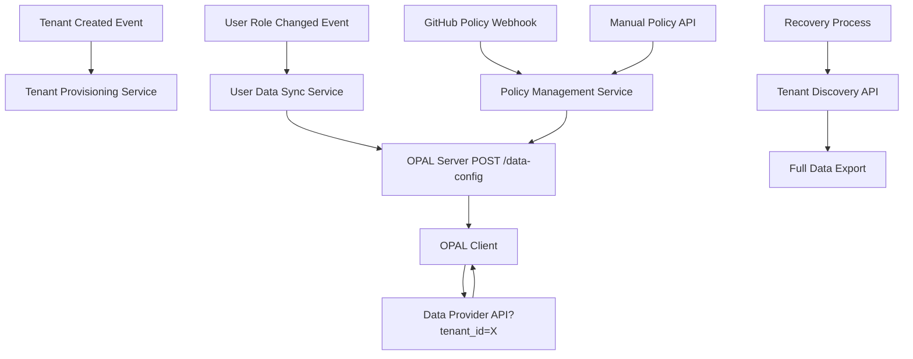

# OPA Zero Poll

**OPA Zero Poll** to nowoczesny system zarządzania politykami RBAC i autoryzacją, oparty na OPA, z integracją OPAL. Architektura oparta o mikroserwisy, integrację przez REST i webhooki GitHub.

---

## Założenia projektu (Proof of Concept)

Ten projekt jest **Proof of Concept (POC)**, który ma za zadanie **pokazać realizowalność** docelowej architektury systemu autoryzacji dla aplikacji enterprise. 

### Architektura docelowa


Docelowy system ma obsługiwać:
- **Wiele aplikacji klienckich** korzystających z centralnej autoryzacji
- **Dynamiczne zarządzanie politykami** przez administratorów
- **Skalowalne rozwiązanie** dla dużej liczby użytkowników i tenantów
- **Real-time aktualizacje** polityk bez restartowania aplikacji

### Rola komponentów w architekturze docelowej

#### 🏢 **Data Provider API** (Port 8110)
**Cel**: Symuluje **Enterprise Data Source** z diagramu docelowego
- Dostarcza dane użytkowników, ról i uprawnień dla każdego tenanta
- Odbiera webhooki GitHub o zmianach w politykach i przekierowuje je do OPAL
- Orkiestruje synchronizację danych między systemami przez API Integration Scripts
- W docelowym systemie zostanie zastąpiony przez prawdziwe systemy HR/ERP/CRM

#### ⚙️ **Provisioning API** (Port 8010) 
**Cel**: Symuluje **Tenant Management System** z diagramu docelowego
- Zarządza cyklem życia tenantów (dodawanie, usuwanie, konfiguracja)
- W docelowym systemie będzie zintegrowany z systemami onboardingu klientów

#### 🔄 **Integration Scripts** (Port 8000)
**Cel**: Implementuje **Data Synchronization Layer** z diagramu docelowego
- Orkiestruje przepływ danych między systemami
- Zapewnia transformację danych do formatu wymaganego przez OPA
- Obsługuje health checks i monitoring

#### 🛡️ **OPA + OPAL**
**Cel**: Stanowią rdzeń **Policy Decision Point (PDP)** z diagramu docelowego
- **OPA Standalone**: Silnik decyzyjny autoryzacji
- **OPAL Server**: Zarządzanie politykami i ich dystrybucja
- **OPAL Client**: Synchronizacja polityk w czasie rzeczywistym

### 📋 Co dowodzi ten POC?

1. **✅ Integracja mikroserwisów** - wszystkie komponenty komunikują się przez REST API
2. **✅ Real-time updates** - zmiany w politykach są automatycznie propagowane przez OPAL
3. **✅ Tenant isolation** - każdy tenant ma odrębne dane i polityki  
4. **✅ GitHub-based policy management** - polityki są zarządzane jako kod
5. **✅ Health monitoring** - każdy komponent eksponuje endpointy health check
6. **✅ Skalowalna architektura** - komponenty mogą być niezależnie skalowane

---

## Architektura POC



- **Data Provider API** (Flask, port 8110) – dostarcza dane ACL dla tenantów, odbiera webhooki GitHub, orkiestruje synchronizację danych
- **Provisioning API** (Flask, port 8010) – zarządzanie tenantami
- **OPA Standalone** (port 8181) – silnik autoryzacji z politykami Rego
- **Integration Scripts** – synchronizacja danych i polityk, obsługa webhooków
- **OPAL Client** – synchronizuje dane z OPAL Server
- **OPAL Server** – zarządza politykami i synchronizacją z OPA

---

## Szybki start

1. **Klonuj repozytorium**
   ```sh
   git clone https://github.com/plduser/opa-zero-poll.git
   cd opa-zero-poll
   ```

2. **Uruchom wszystkie serwisy**
   ```sh
   docker-compose up --build -d
   ```

3. **Sprawdź health check**
   ```sh
   curl http://localhost:8110/health
   ```

4. **Dodaj webhook GitHub**
   - Skonfiguruj webhook na adres: `http://localhost:8110/webhook/policy-update` (lub przez ngrok)
   - Ustaw `WEBHOOK_SECRET` w pliku `.env` lub w zmiennych środowiskowych Dockera

5. **Testuj integrację**
   - Zrób commit i push zmiany w polityce w katalogu `policies/`
   - Sprawdź logi Data Provider API i OPA

---

## Dokumentacja

- [docs/ARCHITECTURE.md](docs/ARCHITECTURE.md) – szczegóły architektury i diagramy
- [docs/API.md](docs/API.md) – opis endpointów
- [docs/WEBHOOKS.md](docs/WEBHOOKS.md) – integracja z GitHub

## Wymagania

- Docker, Docker Compose
- Python 3.11 (jeśli chcesz uruchamiać serwisy lokalnie)

## Autorzy

- Jacek Paszek (plduser) 

---

## 🖥️ Konfiguracja dla różnych systemów operacyjnych

### macOS (Apple Silicon - M1/M2/M3)

**Problem**: Kontenery Docker mogą mieć problemy z architekturą ARM64.

**Rozwiązanie**: W pliku `docker-compose.yml` już dodano `platform: linux/arm64` dla wszystkich serwisów. Jeśli nadal występują problemy:

```yaml
# W docker-compose.yml dla każdego serwisu:
services:
  data-provider-api:
    platform: linux/arm64  # ← Upewnij się że ta linia istnieje
    build: ./new-architecture/components/data-provider-api
  
  # Dla obrazów OPAL i Postgres może być potrzebne dodanie platform:
  opal-server:
    image: permitio/opal-server:latest
    platform: linux/arm64  # ← Dodaj jeśli występują problemy
  
  broadcast_channel:
    image: postgres:alpine  
    platform: linux/arm64  # ← Dodaj jeśli występują problemy
```

**Dodatkowe kroki**:
1. Sprawdź czy Docker Desktop ma włączone "Use Rosetta for x86/amd64 emulation"
2. Jeśli problemy z budowaniem, wymuś rebuild: `docker-compose build --no-cache`

### macOS (Intel)

**Zmiana wymagana**: Zamień `platform: linux/arm64` na `platform: linux/amd64` w `docker-compose.yml`:

```yaml
services:
  data-provider-api:
    platform: linux/amd64  # ← Zmień z arm64 na amd64
```

### Windows

**Wymagania**:
- Docker Desktop z WSL2
- Git for Windows lub WSL2 Ubuntu

**Zmiany w docker-compose.yml**:
```yaml
services:
  data-provider-api:
    platform: linux/amd64  # ← Użyj amd64 na Windows
```

**Potencjalne problemy**:
- **Mapowanie portów**: Sprawdź czy porty 8000, 8010, 8110, 8181, 7001, 7002 nie są zajęte
- **Ścieżki**: Używaj forward slashy (`/`) zamiast backslash (`\`) w ścieżkach

### Linux (Ubuntu/Debian/RHEL)

**Zmiany w docker-compose.yml**:
```yaml
services:
  data-provider-api:
    platform: linux/amd64  # ← Usuń lub zmień na amd64
```

**Dodatkowe zależności**:
```bash
# Ubuntu/Debian
sudo apt update && sudo apt install docker.io docker-compose-plugin

# RHEL/CentOS/Fedora  
sudo dnf install docker docker-compose
```

### 🔧 Sprawdzenie konfiguracji

Po dostosowaniu platformy, sprawdź czy wszystko działa:

```bash
# 1. Restart wszystkich kontenerów
docker-compose down
docker-compose up --build -d

# 2. Sprawdź status
docker-compose ps

# 3. Test health checków
curl http://localhost:8110/health
curl http://localhost:8010/health
curl http://localhost:8181/health
curl http://localhost:8000/health
```

### 🚨 Częste problemy

#### Problem z portami
```bash
# Sprawdź zajęte porty
netstat -tulpn | grep :8110
# lub na macOS
lsof -i :8110

# Zmień porty w docker-compose.yml jeśli zajęte:
ports:
  - "8111:8110"  # Użyj innego portu zewnętrznego
```

#### Problem z pamięcią
```bash
# Zwiększ zasoby Docker Desktop:
# Settings → Resources → Advanced
# RAM: minimum 4GB, zalecane 8GB
# Swap: minimum 2GB
```

#### Problem z logami
```bash
# Sprawdź logi konkretnego serwisu
docker-compose logs data-provider-api
docker-compose logs opal-server

# Sprawdź logi na żywo
docker-compose logs -f
```

---
