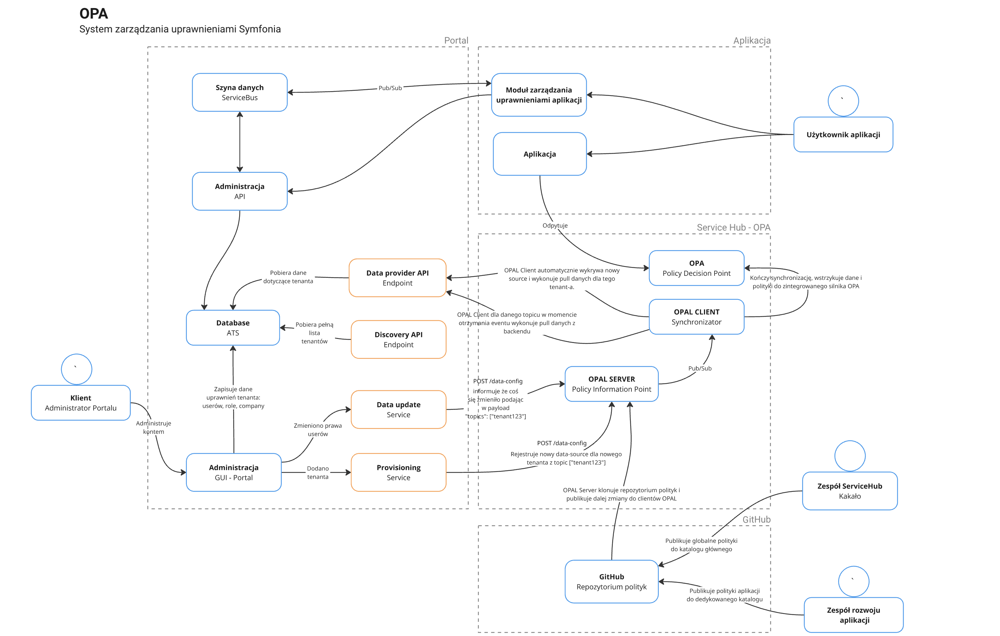
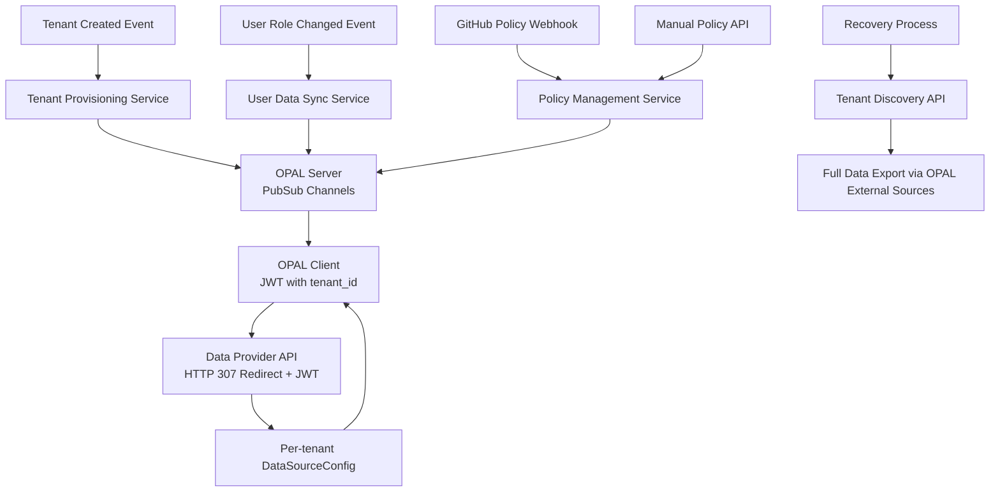

# OPA Zero Poll

**OPA Zero Poll** to nowoczesny system zarządzania politykami RBAC i autoryzacją, oparty na OPA, z integracją OPAL. Architektura oparta o mikroserwisy, integrację przez REST i webhooki GitHub.

## 🎯 Policy Management Portal - Nowa Aplikacja

**Policy Management** to aplikacja webowa zintegrowana z portalem Symfonia, umożliwiająca:

- 📊 **Monitorowanie statusu policy** na dashboardzie z kartami statystyk
- 👁️ **Przeglądanie policy** przez intuicyjny interfejs (tylko odczyt)
- 🔍 **Wyszukiwanie i filtrowanie** policy w czasie rzeczywistym
- 🧪 **Testowanie policy z różnymi danymi wejściowymi** z automatycznym generatorem danych

**Uwaga**: Policy są zarządzane przez system kontroli wersji (Git/GitHub), edycja odbywa się przez proces CI/CD.

**Dostęp**: `http://localhost:3000/policy-management` (po uruchomieniu portalu Symfonia)

**Szczegółowa dokumentacja**: [docs/POLICY_MANAGEMENT.md](docs/POLICY_MANAGEMENT.md)
**Roadmap rozwoju**: [ROADMAP.md](ROADMAP.md)

### 🛣️ **Roadmap Policy Management**

**Faza 1.5** (priorytet krytyczny): **Struktura bazowych uprawnień - Model 2**
- Implementacja hybrydowego modelu uprawnień (RBAC + REBAC-like)
- Separacja ról aplikacyjnych od dostępu do firm
- UI dla zarządzania zespołów i przypisań uprawnień

**Faza 2** (priorytet wysoki): **Testowanie z prawdziwymi danymi systemu**
- Automatyczne pobieranie danych użytkowników z systemu Symfonia
- Testowanie policy z rzeczywistymi rolami i uprawnieniami
- Historia testów i analiza wyników

**Faza 3** (priorytet średni): **Integracja z Git/GitHub workflow**  
- Code review process dla zmian w policy
- Testy automatyczne w pipeline CI/CD
- Historia zmian i mechanizm rollback
- Kontrola zatwierdzeń

**Faza 4** (priorytet niski): **Zaawansowane funkcjonalności**
- Multi-environment support (dev/staging/prod)
- Integracje z Slack/Teams/Jira
- A/B testing policy

---

## Założenia projektu (Proof of Concept)

Ten projekt jest **Proof of Concept (POC)**, który ma za zadanie **pokazać realizowalność** docelowej architektury systemu autoryzacji dla aplikacji enterprise. 

### Architektura docelowa


Docelowy system ma obsługiwać:
- **Wiele aplikacji klienckich** korzystających z centralnej autoryzacji
- **Dynamiczne zarządzanie politykami** przez administratorów
- **Skalowalne rozwiązanie** dla dużej liczby użytkowników i tenantów
- **Real-time aktualizacje** polityk bez restartowania aplikacji

### Rola komponentów w architekturze docelowej

#### 🏢 **Data Provider API** (Port 8110) - **KLUCZOWY KOMPONENT**
**Cel**: Symuluje **Enterprise Data Source** z diagramu docelowego i implementuje **OPAL External Data Sources**
- Dostarcza dane użytkowników, ról i uprawnień dla każdego tenanta
- **Implementuje OPAL External Data Sources API** - zwraca per-tenant DataSourceConfig na podstawie JWT claims
- **Obsługuje HTTP 307 redirects** z JWT token authentication dla OPAL Client requests
- Odbiera webhooki GitHub o zmianach w politykach i przekierowuje je do OPAL Server
- Orkiestruje synchronizację danych między systemami przez API Integration Scripts
- W docelowym systemie zostanie zastąpiony przez prawdziwe systemy HR/ERP/CRM z OPAL integration

#### ⚙️ **Provisioning API** (Port 8010) 
**Cel**: Symuluje **Tenant Management System** z diagramu docelowego
- Zarządza cyklem życia tenantów (dodawanie, usuwanie, konfiguracja)
- W docelowym systemie będzie zintegrowany z systemami onboardingu klientów

#### 🔄 **Integration Scripts** (Port 8000)
**Cel**: Symuluje **legacy data processing** w obecnym POC
- Orkiestruje przepływ danych między systemami (obecna implementacja)
- Zapewnia transformację danych do formatu wymaganego przez OPA
- W docelowym systemie zostanie zastąpiony przez **OPAL External Data Sources**

#### 🛡️ **OPA + OPAL** - **SERCE SYSTEMU**
**Cel**: Stanowią rdzeń **Policy Decision Point (PDP)** z diagramu docelowego
- **OPA Standalone**: Silnik decyzyjny autoryzacji
- **OPAL Server**: Zarządzanie politykami i ich dystrybucja przez PubSub channels
- **OPAL Client**: Synchronizacja polityk w czasie rzeczywistym
- **OPAL External Data Sources**: Dynamiczne konfiguracje per-tenant przez HTTP redirects z JWT authentication

### 📋 Co dowodzi ten POC?

1. **✅ Integracja mikroserwisów** - wszystkie komponenty komunikują się przez REST API
2. **✅ Real-time updates** - zmiany w politykach są automatycznie propagowane przez OPAL
3. **✅ Tenant isolation** - każdy tenant ma odrębne dane źródłowe przez OPAL External Data Sources z JWT claims  
4. **✅ GitHub-based policy management** - polityki są zarządzane jako kod
5. **✅ Health monitoring** - każdy komponent eksponuje endpointy health check
6. **✅ Skalowalna architektura** - komponenty mogą być niezależnie skalowane

---

## Architektura POC



- **Data Provider API** (Flask, port 8110) – implementuje OPAL External Data Sources, dostarcza per-tenant DataSourceConfig, odbiera webhooki GitHub
- **Provisioning API** (Flask, port 8010) – zarządzanie tenantami i konfiguracja OPAL External Sources
- **OPA Standalone** (port 8181) – silnik autoryzacji z politykami Rego
- **Integration Scripts** – synchronizacja danych i polityk (legacy, zastąpione przez OPAL External Sources)
- **OPAL Client** – synchronizuje dane z OPAL Server przez JWT authentication i HTTP redirects
- **OPAL Server** – zarządza politykami i External Data Sources configuration

---

## Szybki start

1. **Klonuj repozytorium**
   ```sh
   git clone https://github.com/plduser/opa-zero-poll.git
   cd opa-zero-poll
   ```

2. **Uruchom wszystkie serwisy**
   ```sh
   docker-compose up --build -d
   ```

3. **Sprawdź health check wszystkich serwisów**
   ```sh
   curl http://localhost:8110/health  # Data Provider API
   curl http://localhost:8010/health  # Provisioning API
   curl http://localhost:8181/health  # OPA Standalone
   curl http://localhost:8000/health  # Integration Scripts
   ```

4. **Dodaj tenant2 (wymagane do testów)**
   ```sh
   # Sprawdź czy tenant2 już istnieje
   curl http://localhost:8010/tenants
   
   # Jeśli tenant2 nie istnieje, dodaj go:
   curl -X POST http://localhost:8010/provision-tenant \
     -H "Content-Type: application/json" \
     -d '{"tenant_id": "tenant2", "tenant_name": "Test Company 2", "status": "active"}'
   
   # Jeśli otrzymasz "Tenant already exists" - to OK, przejdź do następnego kroku
   ```

5. **Wykonaj synchronizację danych**
   ```sh
   curl -X POST http://localhost:8110/sync/trigger
   ```

6. **Uruchom testy systemu**
   ```sh
   # Zainstaluj wymagane zależności dla testów
   pip install requests
   
   # Uruchom automatyczne testy
   python test_full_system.py
   ```

7. **Dodaj webhook GitHub (opcjonalnie)**
   - Skonfiguruj webhook na adres: `http://localhost:8110/webhook/policy-update` (lub przez ngrok)
   - Ustaw `WEBHOOK_SECRET` w pliku `.env` lub w zmiennych środowiskowych Dockera

8. **Testuj autoryzację ręcznie**
   ```sh
   # Test: Admin może czytać
   curl -X POST http://localhost:8181/v1/data/rbac/allow \
     -H "Content-Type: application/json" \
     -d '{"input": {"user": "user1", "role": "admin", "action": "read", "resource": "data", "tenant": "tenant1"}}'
   
   # Test: Viewer nie może pisać  
   curl -X POST http://localhost:8181/v1/data/rbac/allow \
     -H "Content-Type: application/json" \
     -d '{"input": {"user": "user3", "role": "viewer", "action": "write", "resource": "data", "tenant": "tenant2"}}'
   ```

---

## Dokumentacja

- [docs/ARCHITECTURE.md](docs/ARCHITECTURE.md) – szczegóły architektury i diagramy
- [docs/API.md](docs/API.md) – opis endpointów
- [docs/WEBHOOKS.md](docs/WEBHOOKS.md) – integracja z GitHub
- [docs/POLICY_MANAGEMENT.md](docs/POLICY_MANAGEMENT.md) – **dokumentacja aplikacji Policy Management w portalu Symfonia**

## Testowanie systemu

System zawiera automatyczne testy integracyjne w pliku `test_full_system.py`. Testy sprawdzają:

### 🔍 **Faza 1: Health Check Serwisów**
- Sprawdza czy wszystkie 4 główne serwisy odpowiadają prawidłowo
- Weryfikuje endpointy `/health` każdego komponentu

### 🔄 **Faza 2: Mechanizm Synchronizacji**  
- Testuje endpoint `/sync/health` dla statusu synchronizacji
- Sprawdza pełną synchronizację (`/sync/trigger`)
- Testuje synchronizację specyficzną dla tenanta (`/sync/tenant/{id}`)

### 📊 **Faza 3: Weryfikacja Danych w OPA**
- Sprawdza czy dane obu tenantów zostały załadowane do OPA
- Weryfikuje strukturę danych (użytkownicy, role, uprawnienia)

### 🔐 **Faza 4: Testowanie Autoryzacji**
Wykonuje 6 różnych scenariuszy autoryzacji:
- ✅ Admin może czytać
- ✅ Admin może pisać  
- ✅ User może czytać własne dane
- ✅ Viewer może czytać
- ❌ Viewer nie może pisać
- ❌ User nie może usuwać

### Uruchomienie testów

**Wymagania przed testami:**
1. Wszystkie serwisy muszą być uruchomione (`docker-compose up -d`)
2. Tenant2 musi być dodany (`curl -X POST http://localhost:8010/provision-tenant ...`)
3. Synchronizacja musi być wykonana (`curl -X POST http://localhost:8110/sync/trigger`)

**Komenda:**
```bash
# Opcja 1: Automatyczne testy (wymaga pip install requests)
python test_full_system.py

# Opcja 2: Ręczne testowanie przez curl
# 1. Health check serwisów
curl http://localhost:8110/health  # Data Provider API
curl http://localhost:8010/health  # Provisioning API  
curl http://localhost:8181/health  # OPA Standalone
curl http://localhost:8000/health  # Integration Scripts

# 2. Sprawdź dane w OPA
curl http://localhost:8181/v1/data/tenant_data/tenant1
curl http://localhost:8181/v1/data/tenant_data/tenant2

# 3. Test autoryzacji
curl -X POST http://localhost:8181/v1/data/rbac/allow \
  -H "Content-Type: application/json" \
  -d '{"input": {"user": "user1", "role": "admin", "action": "read", "resource": "data", "tenant": "tenant1"}}'
```

**Oczekiwany wynik:**
```
🎉 ALL TESTS PASSED! System is working correctly!
✅ Services: All healthy
✅ Synchronization: Working  
✅ Data Loading: Working
✅ Authorization: Working
```

## Wymagania

- Docker, Docker Compose
- Python 3.11 (jeśli chcesz uruchamiać serwisy lokalnie)

## Autorzy

- Jacek Paszek (plduser)
- Claude (Anthropic) - AI Assistant 

---

## 🖥️ Konfiguracja dla różnych systemów operacyjnych

### macOS (Apple Silicon - M1/M2/M3)

**Problem**: Kontenery Docker mogą mieć problemy z architekturą ARM64.

**Rozwiązanie**: W pliku `docker-compose.yml` już dodano `platform: linux/arm64` dla wszystkich serwisów. Jeśli nadal występują problemy:

```yaml
# W docker-compose.yml dla każdego serwisu:
services:
  data-provider-api:
    platform: linux/arm64  # ← Upewnij się że ta linia istnieje
    build: ./new-architecture/components/data-provider-api
  
  # Dla obrazów OPAL i Postgres może być potrzebne dodanie platform:
  opal-server:
    image: permitio/opal-server:latest
    platform: linux/arm64  # ← Dodaj jeśli występują problemy
  
  broadcast_channel:
    image: postgres:alpine  
    platform: linux/arm64  # ← Dodaj jeśli występują problemy
```

**Dodatkowe kroki**:
1. Sprawdź czy Docker Desktop ma włączone "Use Rosetta for x86/amd64 emulation"
2. Jeśli problemy z budowaniem, wymuś rebuild: `docker-compose build --no-cache`

### macOS (Intel)

**Zmiana wymagana**: Zamień `platform: linux/arm64` na `platform: linux/amd64` w `docker-compose.yml`:

```yaml
services:
  data-provider-api:
    platform: linux/amd64  # ← Zmień z arm64 na amd64
```

### Windows

**Wymagania**:
- Docker Desktop z WSL2
- Git for Windows lub WSL2 Ubuntu

**Zmiany w docker-compose.yml**:
```yaml
services:
  data-provider-api:
    platform: linux/amd64  # ← Użyj amd64 na Windows
```

**Potencjalne problemy**:
- **Mapowanie portów**: Sprawdź czy porty 8000, 8010, 8110, 8181, 7001, 7002 nie są zajęte
- **Ścieżki**: Używaj forward slashy (`/`) zamiast backslash (`\`) w ścieżkach

### Linux (Ubuntu/Debian/RHEL)

**Zmiany w docker-compose.yml**:
```yaml
services:
  data-provider-api:
    platform: linux/amd64  # ← Usuń lub zmień na amd64
```

**Dodatkowe zależności**:
```bash
# Ubuntu/Debian
sudo apt update && sudo apt install docker.io docker-compose-plugin

# RHEL/CentOS/Fedora  
sudo dnf install docker docker-compose
```

### 🔧 Sprawdzenie konfiguracji

Po dostosowaniu platformy, sprawdź czy wszystko działa:

```bash
# 1. Restart wszystkich kontenerów
docker-compose down
docker-compose up --build -d

# 2. Sprawdź status
docker-compose ps

# 3. Test health checków
curl http://localhost:8110/health
curl http://localhost:8010/health
curl http://localhost:8181/health
curl http://localhost:8000/health
```

### 🚨 Częste problemy

#### Problem z portami
```bash
# Sprawdź zajęte porty
netstat -tulpn | grep :8110
# lub na macOS
lsof -i :8110

# Zmień porty w docker-compose.yml jeśli zajęte:
ports:
  - "8111:8110"  # Użyj innego portu zewnętrznego
```

#### Problem z pamięcią
```bash
# Zwiększ zasoby Docker Desktop:
# Settings → Resources → Advanced
# RAM: minimum 4GB, zalecane 8GB
# Swap: minimum 2GB
```

#### Problem z logami
```bash
# Sprawdź logi konkretnego serwisu
docker-compose logs data-provider-api
docker-compose logs opal-server

# Sprawdź logi na żywo
docker-compose logs -f
```

---
