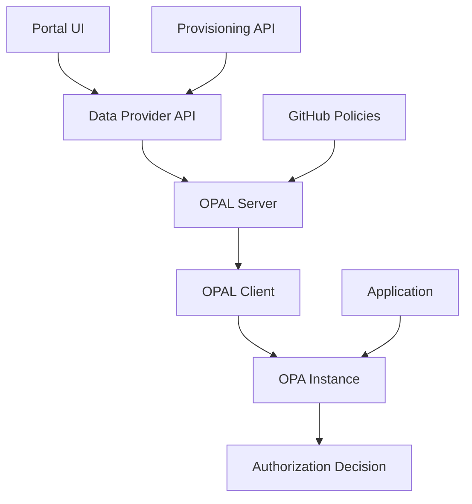

# 🔐 OPA Zero Poll - Multi-Tenant Authorization System

**Proof of Concept** systemu autoryzacji opartego na **Open Policy Agent (OPA)** z architekturą **OPAL External Data Sources** dla środowisk multi-tenant. System zapewnia separację danych między tenantami, dynamiczne zarządzanie politykami i skalowalne rozwiązanie RBAC + REBAC.

## 🏗️ **Architektura Systemu**

### **🔑 KLUCZOWE KOMPONENTY:**

#### 🌐 **Data Provider API** (Port 8110) - **KLUCZOWY KOMPONENT**
- **SERCE SYSTEMU** - implementuje OPAL External Data Sources z JWT authentication
- Dostarcza per-tenant DataSourceConfig z HTTP 307 redirects
- Obsługuje Model 1 (legacy ACL) i Model 2 (RBAC + REBAC-like)
- Przygotowany do integracji z Portal UI dla zarządzania uprawnieniami

#### 🏛️ **Provisioning API** (Port 8010)
- Zarządzanie tenantami i ich konfiguracją
- CRUD operations dla tenant lifecycle
- Integracja z systemami zewnętrznymi

#### 🔄 **OPAL Server + Client** (Porty 7002, 7000)
- **SERCE SYSTEMU** - orkiestruje synchronizację polityk i danych
- OPAL External Data Sources dla per-tenant data retrieval
- Real-time updates przez PubSub channels
- Zastępuje legacy Integration Scripts

#### ⚖️ **OPA Standalone** (Port 8181)
- Policy engine z hybrydowymi regułami RBAC + REBAC-like
- Multi-tenant data isolation
- High-performance authorization decisions

## 🎯 **Model Uprawnień**

### **Model 2: Hybrid RBAC + REBAC**
- **Separacja ról aplikacyjnych** od dostępu do firm/zasobów
- **Teams** dla łatwego kopiowania wzorców uprawnień w dużych organizacjach
- **Additive permissions** (sumowanie uprawnień z różnych źródeł)
- **OR Logic** autoryzacji (dostęp przez dowolną ścieżkę)

**Struktura danych:**
- `roles`: Role aplikacyjne per użytkownik (np. `user42.fk = ["fk_admin"]`)
- `access`: Dostęp do firm per tenant (np. `user42.tenant125 = ["company1", "company2"]`)
- `teams`: Zespoły łączące role z firmami (np. `kadry.roles.hr = ["hr_editor"]`)
- `memberships`: Członkostwo w zespołach (np. `user99 = ["kadry"]`)
- `permissions`: Definicje uprawnień (np. `fk.fk_admin = ["view_entry", "edit_entry"]`)

### **Tenant Isolation Mechanism**
- **OPAL External Data Sources** z JWT claims zawierającymi tenant_id
- Per-tenant DataSourceConfig responses
- Dynamiczne data retrieval bez zmian w kodzie

## 📊 **Architektura Flow**



**Komponenty:**
- **Data Provider API** (Flask, port 8110) – implementuje OPAL External Data Sources, dostarcza per-tenant DataSourceConfig
- **Provisioning API** (FastAPI, port 8010) – zarządzanie tenantami i konfiguracją
- **OPAL Server/Client** – synchronizacja polityk i danych w czasie rzeczywistym
- **OPA Standalone** – policy engine z hybrydowymi regułami autoryzacji

## 🚀 **Quick Start**

### **1. Uruchom środowisko Docker**
```bash
cd new-architecture
docker-compose up -d
```

### **2. Sprawdź status serwisów**
```bash
# Health checks
curl http://localhost:8110/health  # Data Provider API
curl http://localhost:8010/health  # Provisioning API
curl http://localhost:8181/        # OPA
curl http://localhost:7002/healthcheck  # OPAL Server
curl http://localhost:7000/healthcheck  # OPAL Client
```

### **3. Testuj autoryzację**
```bash
# Model 1 (legacy)
curl "http://localhost:8181/v1/data/rbac/allow" \
  -H "Content-Type: application/json" \
  -d '{"input": {"user": "user1", "action": "read", "resource": "document1", "tenant": "tenant1"}}'

# Model 2 (hybrid RBAC + REBAC)
curl "http://localhost:8110/v2/users/user42/permissions?app=fk&action=view_entry&company_id=company1&tenant_id=tenant125"
```

### **4. Zarządzanie tenantami**
```bash
# Dodaj nowego tenanta
curl -X POST http://localhost:8010/tenants \
  -H "Content-Type: application/json" \
  -d '{"tenant_id": "new_tenant", "name": "New Company", "config": {}}'

# Lista tenantów
curl http://localhost:8010/tenants
```

### **5. Dane autoryzacji**
```bash
# Model 1 - ACL per tenant
curl http://localhost:8110/tenants/tenant1/acl

# Model 2 - Hybrid authorization data
curl http://localhost:8110/v2/authorization
```

## 📁 **Struktura Projektu**

```
new-architecture/
├── components/
│   ├── data-provider-api/     # OPAL External Data Sources + Model 2
│   ├── provisioning-api/      # Tenant management
│   ├── opa-standalone/        # Policy engine
│   ├── opal-server/          # Policy & data orchestration
│   └── opal-client/          # Data synchronization
├── docs/                     # Dokumentacja architektury
└── docker-compose.yml       # Orchestration
```

## 📚 **Dokumentacja**

- [docs/ARCHITECTURE.md](docs/ARCHITECTURE.md) – szczegółowa architektura systemu
- [docs/model2-data-structure.md](docs/model2-data-structure.md) – specyfikacja Model 2
- [docs/model2-example-scenarios.md](docs/model2-example-scenarios.md) – przykłady użycia

## 🔄 **Roadmap**

### **Aktualnie w rozwoju:**
- ✅ Model 2 (RBAC + REBAC-like) - struktura i dokumentacja
- 🔄 **Task 36**: OPAL External Data Sources implementation
- 🔄 **Task 25**: Data Provider API translation layer (Portal → Model 2)

### **Planowane:**
- **Dynamic Resources Management** (Permit.io-style)
- **Resource Explorer UI** dla administratorów
- **Auto-generated OPA Bundles** z definicji UI
- **GitOps Policy Management**

## 🧪 **Testing**

```bash
# Testy jednostkowe
cd new-architecture/components/data-provider-api
python -m pytest tests/

# Testy integracyjne
cd new-architecture/tests
python test_full_system.py
```

## 🔧 **Konfiguracja**

### **Zmienne środowiskowe:**
```bash
# API Keys (w .env lub mcp.json)
ANTHROPIC_API_KEY=your_key_here
PERPLEXITY_API_KEY=your_key_here

# URLs (opcjonalne)
OPA_URL=http://opa-standalone:8181
PROVISIONING_API_URL=http://provisioning-api:8010
```

### **Model Configuration:**
```bash
# Konfiguracja AI models przez TaskMaster
task-master models --setup
```

---

**Status:** 🚧 **Active Development** - Proof of Concept z focus na OPAL External Data Sources i Model 2 implementation.
