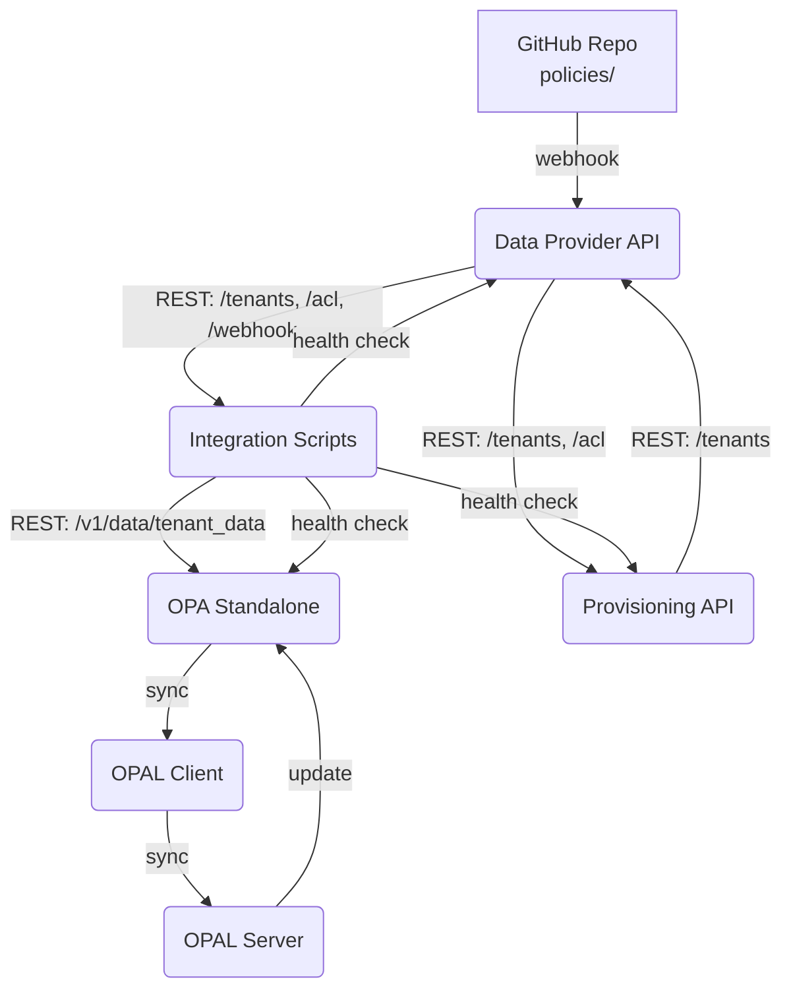

# OPA Zero Poll

**OPA Zero Poll** to nowoczesny system zarządzania politykami RBAC i autoryzacją, oparty na OPA, z integracją OPAL. Architektura oparta o mikroserwisy, integrację przez REST i webhooki GitHub.

---

## Architektura



- **Data Provider API** (Flask, port 8110) – dostarcza dane ACL dla tenantów, odbiera webhooki GitHub
- **Provisioning API** (Flask, port 8010) – zarządzanie tenantami
- **OPA Standalone** (port 8181) – silnik autoryzacji z politykami Rego
- **Integration Scripts** – synchronizacja danych i polityk, obsługa webhooków
- **OPAL Client** – synchronizuje dane z OPAL Server
- **OPAL Server** – zarządza politykami i synchronizacją z OPA

---

## Szybki start

1. **Klonuj repozytorium**
   ```sh
   git clone https://github.com/plduser/opa-zero-poll.git
   cd opa-zero-poll
   ```

2. **Uruchom wszystkie serwisy**
   ```sh
   docker-compose up --build -d
   ```

3. **Sprawdź health check**
   ```sh
   curl http://localhost:8110/health
   ```

4. **Dodaj webhook GitHub**
   - Skonfiguruj webhook na adres: `http://localhost:8110/webhook/policy-update` (lub przez ngrok)
   - Ustaw `WEBHOOK_SECRET` w pliku `.env` lub w zmiennych środowiskowych Dockera

5. **Testuj integrację**
   - Zrób commit i push zmiany w polityce w katalogu `policies/`
   - Sprawdź logi Data Provider API i OPA

---

## Dokumentacja

- [docs/ARCHITECTURE.md](docs/ARCHITECTURE.md) – szczegóły architektury i diagramy
- [docs/API.md](docs/API.md) – opis endpointów
- [docs/WEBHOOKS.md](docs/WEBHOOKS.md) – integracja z GitHub

## Wymagania

- Docker, Docker Compose
- Python 3.11 (jeśli chcesz uruchamiać serwisy lokalnie)

## Autorzy

- Jacek Paszek (plduser) 