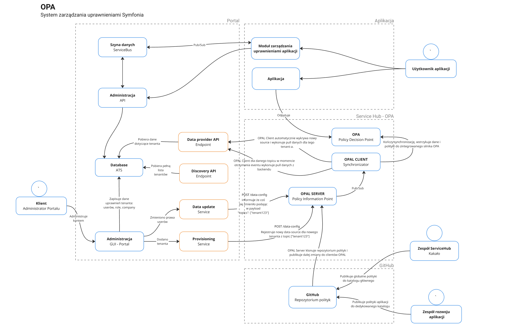
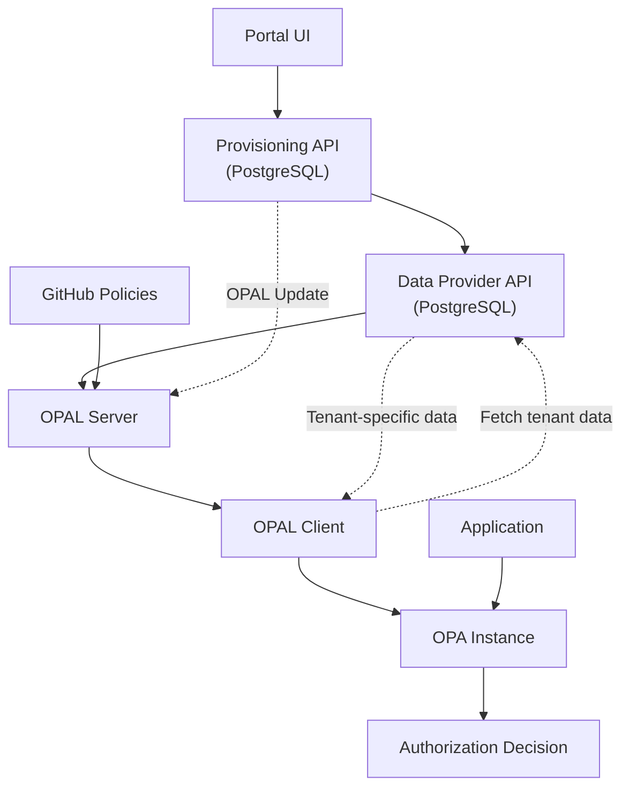
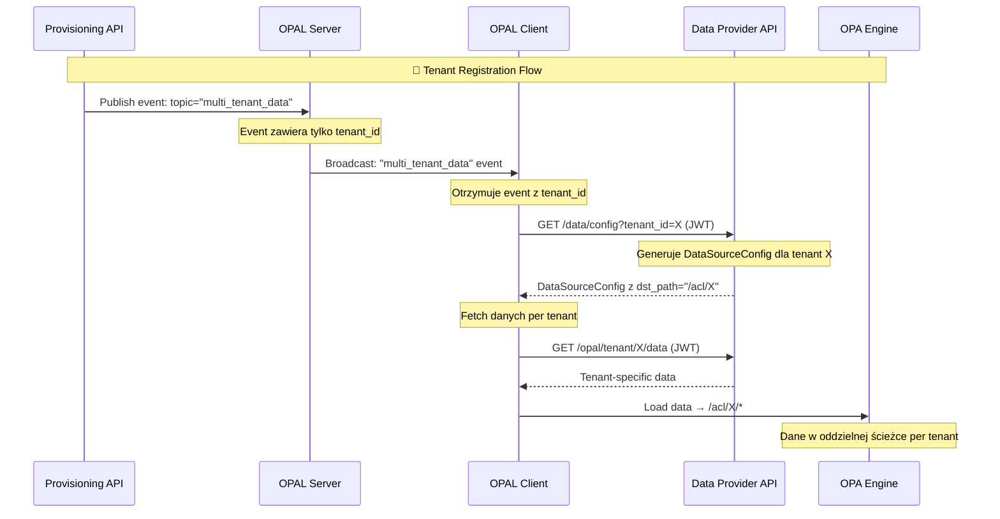

# OPA Zero Poll - Multi-Tenant Authorization System

**Proof of Concept** systemu autoryzacji opartego na **Open Policy Agent (OPA)** z architekturą **OPAL External Data Sources** dla środowisk multi-tenant.



Disclaimer: Do przygotowania POC nie użyto żadnych (niebędących publicznie dostępnymi) zasobów firmowych. Portal i aplikacje są odtworzone na podstawie screenów i CSS. Elementy architektury pokazane na diagramie są uogólnione i nie zawierają w sobie żadnych specyficznych dla naszej firmy rozwiązań. Zależało mi na tym etapie na łatwiejszej dostępności w firmie tego repo, w razie dalszych działań repo może zostać przeniesione na zasoby firmowe, albo ukryte.

## Problem i Rozwiązanie

W **dużych środowiskach enterprise z tysiącami tenantów**, standardowe mechanizmy synchronizacji danych z OPA są niewystarczające:

❌ **Pliki statyczne** - brak dynamicznej aktualizacji  
❌ **OPA Bundles** - problemy z skalowalnością przy tysiącach tenantów  
❌ **Standardowe OPAL External Data Sources** - brak per-tenant isolation  

✅ **Nasze rozwiązanie**: **Dynamiczne OPAL External Data Sources** z single topic multi-tenant i hierarchiczną izolacją, umożliwiające:
- **Per-tenant data isolation** bez zmian w kodzie
- **Skalowalne provisioning** nowych tenantów w runtime
- **Single topic multi-tenant** architecture dla tysięcy tenantów
- **Eliminację duplikacji danych** między systemami

---

## Architektura

### Komponenty OPA

#### OPA Standalone (Port 8181)
- **Policy engine** z hybrydowymi regułami RBAC + REBAC-like
- **Multi-tenant data isolation** przez hierarchiczne ścieżki `/acl/{tenant_id}`
- **High-performance authorization decisions**

#### OPAL Server (Port 7002)
- **Zarządzanie politykami** i External Data Sources configuration
- **PubSub channels** dla real-time updates
- **GitHub integration** dla policy management
- **Single topic multi-tenant** orchestration

#### OPAL Client (Port 7000)
- **OPAL External Data Sources flow** implementation
- **JWT-based tenant isolation** z automatycznym data retrieval
- **Real-time synchronizacja** danych z OPAL Server
- **Per-tenant DataSourceConfig** processing

### Komponenty warstwy komunikacji ze źródłem danych (Portalem)

#### Data Provider API (Port 8110)
- **Flask** z integracją **PostgreSQL**
- Implementuje **OPAL External Data Sources** z JWT authentication
- Dostarcza **per-tenant DataSourceConfig** z single topic i hierarchicznym dst_path
- Obsługuje **Model 1** (legacy ACL) i **Model 2** (RBAC + REBAC-like)
- **Database integration** - eliminuje duplikację danych z Provisioning API

#### Provisioning API (Port 8010)
- **FastAPI** z **PostgreSQL RBAC/REBAC**
- **Kompletny provisioning tenantów**: Tenant → Firma → Administrator
- **Automatyczne uprawnienia Portal Administrator** (6 kluczowych uprawnień)
- **OPAL integration** z single topic multi-tenant publishing


### Model Uprawnień

#### Model 2: Hybrid RBAC + REBAC
- **Separacja ról aplikacyjnych** od dostępu do firm/zasobów
- **Teams** dla łatwego kopiowania wzorców uprawnień w dużych organizacjach
- **Additive permissions** (sumowanie uprawnień z różnych źródeł)
- **OR Logic** autoryzacji (dostęp przez dowolną ścieżkę)

**Struktura danych:**
- `roles`: Role aplikacyjne per użytkownik (np. `user42.fk = ["fk_admin"]`)
- `access`: Dostęp do firm per tenant (np. `user42.tenant125 = ["company1", "company2"]`)
- `teams`: Zespoły łączące role z firmami (np. `kadry.roles.hr = ["hr_editor"]`)
- `memberships`: Członkostwo w zespołach (np. `user99 = ["kadry"]`)
- `permissions`: Definicje uprawnień (np. `fk.fk_admin = ["view_entry", "edit_entry"]`)

### Tenant Isolation Mechanizm

**OPAL External Data Sources** z **single topic multi-tenant** i **hierarchiczną izolacją**:
1. **Provisioning API** powiadamia OPAL Server o zmianach tenantów
2. **OPAL Server** publikuje event na single topic `multi_tenant_data`  
3. **OPAL Client** otrzymuje event i fetchuje dane z Data Provider API
4. **Separacja tenantów** przez różne URL endpoints i `dst_path`: `/acl/{tenant_id}`
5. **OPA** otrzymuje dane w oddzielonych ścieżkach per tenant z pełną izolacją

### Architektura Flow


```mermaid
graph TD
    A["Portal UI"] --> B["Provisioning API<br/>(PostgreSQL)"]
    B --> C["Data Provider API<br/>(PostgreSQL)"]
    C --> D["OPAL Server"]
    D --> E["OPAL Client"]
    E --> F["OPA Instance"]
    
    G["GitHub Policies"] --> D
    H["Application"] --> F
    F --> I["Authorization Decision"]
    
    B -.->|"OPAL Update"| D
    E -.->|"Fetch tenant data"| C
    C -.->|"Tenant-specific data"| E
```

**Kluczowe przepływy:**
- **Provisioning**: Portal UI → Provisioning API → PostgreSQL → OPAL Server
- **Data Sync**: OPAL Client → Data Provider API (JWT) → PostgreSQL → OPA
- **Authorization**: Application → OPA → Decision

---

## Matryca 4 Mechanizmów OPAL/OPA

### Tabela Porównawcza Mechanizmów Synchronizacji Danych

| Mechanizm | Scalability | Tenant Isolation | Real-time Updates | Implementation Complexity | Best Use Case |
|-----------|-------------|------------------|-------------------|---------------------------|---------------|
| **🔧 Pliki Statyczne** | ⭐ | ⭐ | ❌ | ⭐⭐⭐ | Prototypy, statyczne dane |
| **📦 OPA Bundles** | ⭐⭐ | ⭐⭐ | ⭐⭐ | ⭐⭐ | Małe/średnie systemy |
| **🌐 OPAL External Data** | ⭐⭐⭐ | ⭐⭐⭐ | ⭐⭐⭐ | ⭐⭐ | Single tenant systems |
| **🚀 Single Topic Multi-Tenant** | ⭐⭐⭐⭐⭐ | ⭐⭐⭐⭐⭐ | ⭐⭐⭐⭐⭐ | ⭐ | **Enterprise Multi-Tenant** |

### Szczegółowe Porównanie

#### 1. 🔧 Pliki Statyczne (Files)
**Architektura**: `Data → JSON Files → OPA Load`

**Zalety:**
- ✅ Najprostsza implementacja
- ✅ Brak dodatkowych komponentów
- ✅ Szybkie prototypowanie

**Wady:**
- ❌ Brak automatycznych aktualizacji
- ❌ Problemy z tenant isolation
- ❌ Ręczne zarządzanie danymi
- ❌ Brak real-time synchronizacji

**Use Case**: Demonstracje, proof-of-concept, dane statyczne

---

#### 2. 📦 OPA Bundles
**Architektura**: `Data → Bundle Server → OPA Polling → Load`

**Zalety:**
- ✅ Automatyczne pobieranie danych
- ✅ Wersjonowanie bundles
- ✅ Built-in retry mechanism
- ✅ Sprawdzone rozwiązanie

**Wady:**
- ❌ Polling latency (typowo 30s-5min)
- ❌ Trudności z per-tenant bundles
- ❌ Problemy scalability przy tysiącach tenantów
- ❌ Bundle size limits

**Use Case**: Małe/średnie systemy, periodyczne aktualizacje

---

#### 3. 🌐 OPAL External Data Sources (Standard)
**Architektura**: `External API → OPAL Server → OPAL Client → OPA`

**Zalety:**
- ✅ Real-time updates (push-based)
- ✅ Elastyczna konfiguracja źródeł
- ✅ Per-topic data separation
- ✅ JWT authentication support

**Wady:**
- ❌ Multiple topics per tenant (N × tenants topics)
- ❌ Topic explosion problem
- ❌ Skomplikowana konfiguracja multi-tenant
- ❌ Resource overhead

**Use Case**: Single tenant systems, systemy z kilku tenantami

---

#### 4. 🚀 Single Topic Multi-Tenant (Nasza Implementacja)
**Architektura**: `Data → Provisioning API → OPAL Single Topic → OPAL Client → JWT Fetch → Data Provider API → OPA`

**Zalety:**
- ✅ **Jeden topic dla wszystkich tenantów**
- ✅ **Automatyczne per-tenant isolation** przez hierarchiczne `dst_path`
- ✅ **Scalable do tysięcy tenantów** bez topic explosion
- ✅ **Real-time provisioning** nowych tenantów
- ✅ **JWT-based tenant data fetching**
- ✅ **Zero code changes** dla nowych tenantów
- ✅ **Database-driven configuration**

**Innowacje:**
- 🚀 **Single Topic Pattern**: `multi_tenant_data` zamiast per-tenant topics
- 🚀 **Dynamic Data Source Config**: Automatyczne generowanie config per tenant
- 🚀 **Hierarchical dst_path**: `/acl/{tenant_id}` zapewnia pełną izolację
- 🚀 **JWT Tenant Context**: Automatic tenant resolution w Data Provider API

**Use Case**: **Enterprise multi-tenant systems** z tysiącami tenantów

### Przepływ Single Topic Multi-Tenant


```mermaid
sequenceDiagram
    participant P as Provisioning API
    participant OS as OPAL Server
    participant OC as OPAL Client
    participant DP as Data Provider API
    participant OPA as OPA Engine

    Note over P,OPA: 🚀 Tenant Registration Flow
    P->>OS: Publish event: topic="multi_tenant_data"
    Note over OS: Event zawiera tylko tenant_id
    
    OS->>OC: Broadcast: "multi_tenant_data" event
    Note over OC: Otrzymuje event z tenant_id
    
    OC->>DP: GET /data/config?tenant_id=X (JWT)
    Note over DP: Generuje DataSourceConfig dla tenant X
    
    DP-->>OC: DataSourceConfig z dst_path="/acl/X"
    Note over OC: Fetch danych per tenant
    
    OC->>DP: GET /opal/tenant/X/data (JWT)
    DP-->>OC: Tenant-specific data
    
    OC->>OPA: Load data → /acl/X/*
    Note over OPA: Dane w oddzielnej ścieżce per tenant
```

### Kluczowe Różnice vs Standard OPAL

| Aspekt | Standard OPAL | Single Topic Multi-Tenant |
|--------|---------------|---------------------------|
| **Topics** | N topics (per tenant) | 1 topic (`multi_tenant_data`) |
| **Configuration** | Static per topic | Dynamic per tenant |
| **Scalability** | Limited by topic count | Unlimited tenants |
| **Tenant Isolation** | Topic-based | dst_path hierarchical |
| **Provisioning** | Manual topic setup | Automatic in runtime |
| **Data Fetching** | Per topic URL | JWT-based tenant resolution |

### Dlaczego Single Topic Multi-Tenant?

**Problem tradycyjnego OPAL**: 
- 1000 tenantów = 1000 topics 
- 1000 data source configs
- Topic explosion problem
- Konfiguracja nightmare

**Nasze rozwiązanie**:
- 1000 tenantów = 1 topic (`multi_tenant_data`)
- Dynamic data source config generation
- Hierarchical isolation przez `dst_path`
- Automatic tenant provisioning

### Performance & Scalability

| Metryka | Single Topic Multi-Tenant | Standard OPAL |
|---------|---------------------------|---------------|
| **Topics Count** | 1 | N (tenants) |
| **Memory Usage** | O(1) | O(N) |
| **Config Complexity** | O(1) | O(N) |
| **Provisioning Time** | < 1s | Manual setup |
| **Data Isolation** | 100% (hierarchical) | 100% (topic-based) |

---

## Dokumentacja szczegółowa

- [docs/ARCHITECTURE.md](docs/ARCHITECTURE.md) – szczegółowa architektura systemu
- [docs/PORTAL_MANAGEMENT.md](docs/PORTAL_MANAGEMENT.md) – zarządzanie uprawnieniami w Portal Symfonia
- [docs/OPAL_SINGLE_TOPIC_MULTI_TENANT.md](docs/OPAL_SINGLE_TOPIC_MULTI_TENANT.md) – dynamiczne dodawanie tenantów i single topic multi-tenant
- [docs/model2-data-structure.md](docs/model2-data-structure.md) – specyfikacja Model 2
- [docs/TEAMS_MANAGEMENT.md](docs/TEAMS_MANAGEMENT.md) – zarządzanie zespołami w dużych organizacjach
- [docs/model2-example-scenarios.md](docs/model2-example-scenarios.md) – przykłady użycia

---

## 🚀 Quick Start & Deployment

Gotowy do uruchomienia? Mamy dla Ciebie kompletne przewodniki deployment:

### **🎯 [Szybki Start (5 minut)](docs/QUICK_START.md)**
Uruchom kompletny stack w 4 krokach:
```bash
git clone <repository-url> && cd opa_zero_poll
./scripts/setup.sh --with-portal
./scripts/verify.sh --test-tenant  
curl http://localhost:3000
```

### **📚 [Kompletny Przewodnik Deployment](docs/DEPLOYMENT.md)**
Szczegółowa dokumentacja obejmująca:
- Multi-platform setup (macOS/Linux/Windows)
- Environment configuration & security
- Production deployment guidelines
- Monitoring & troubleshooting
- Performance optimization

### **🛠️ Automatyczne Skrypty Setup**
- `./scripts/setup.sh` - Automatyczny setup z wykrywaniem platformy
- `./scripts/verify.sh` - Kompletna weryfikacja systemu
- `./scripts/platform-detect.sh` - Detekcja i konfiguracja platformy
- `./scripts/restart.sh` - Inteligentny restart serwisów

**Wymagania:** Docker Desktop, 8GB RAM, porty 3000, 8010, 8110, 8181, 7000-7002

**Support:** macOS (Intel/Apple Silicon), Linux (Ubuntu/RHEL), Windows (WSL2)

---

## 🧪 Testowanie & Weryfikacja

Kompletne scenariusze testowe i diagnostyka:

### **End-to-End Testy**
- [Scenariusze End-to-End](docs/END_TO_END_SCENARIOS.md) - Pełne przepływy pracy z komendami CURL, monitoringiem logów i diagnostyką
- [Testy Permission Event Translator](docs/PERMISSION_EVENT_TRANSLATOR_TESTS.md) - Szczegółowe testy systemu notyfikacji

### **Automatyczne Testy**
```bash
# Test kompletnego provisioning tenanta
cd new-architecture && python test_complete_tenant_provisioning_v2.py

# Testy komponentów
cd new-architecture/components/data-provider-api && python -m pytest tests/ -v

# Weryfikacja systemu
./scripts/verify.sh --detailed --test-tenant
```

### **Quick Test - Single Tenant**
```bash
# 1. Uruchom stack
./scripts/setup.sh

# 2. Utwórz test tenant
curl -X POST http://localhost:8010/provision-tenant \
  -H "Content-Type: application/json" \
  -d '{"tenant_id": "test_123", "tenant_name": "Test Company", "admin_email": "admin@test.com", "admin_name": "Admin User"}'

# 3. Test autoryzacji
curl "http://localhost:8181/v1/data/rbac/allow" \
  -H "Content-Type: application/json" \
  -d '{"input": {"user": "admin_test_123", "action": "manage_users", "resource": "portal", "tenant": "test_123"}}'
```

---

## 📁 Struktura Projektu

```
opa_zero_poll/
├── new-architecture/          # Backend components
│   ├── components/
│   │   ├── data-provider-api/     # OPAL External Data Sources + Model 2
│   │   ├── provisioning-api/      # Tenant management (PostgreSQL)
│   │   ├── opa-standalone/        # Policy engine
│   │   ├── opal-server/          # Policy & data orchestration
│   │   └── opal-client/          # Data synchronization
│   └── database/              # PostgreSQL schema & migrations
├── app/                       # Next.js Portal UI (Port 3000)
├── docs/                      # 📚 Kompletna dokumentacja
├── scripts/                   # 🛠️ Automatyczne skrypty setup/verify
├── docker-compose.yml         # 🐳 Orchestration config
└── env.template              # ⚙️ Environment configuration template
```

## ⚙️ Konfiguracja

**Szczegółowa konfiguracja:** Zobacz [Przewodnik Deployment](docs/DEPLOYMENT.md) dla kompletnych instrukcji environment.

**Quick Config:**
```bash
# 1. Automatyczna detekcja platformy
./scripts/platform-detect.sh

# 2. Setup environment  
cp env.template .env
# (edytuj .env według potrzeb)

# 3. Uruchomienie
./scripts/setup.sh --with-portal
```
