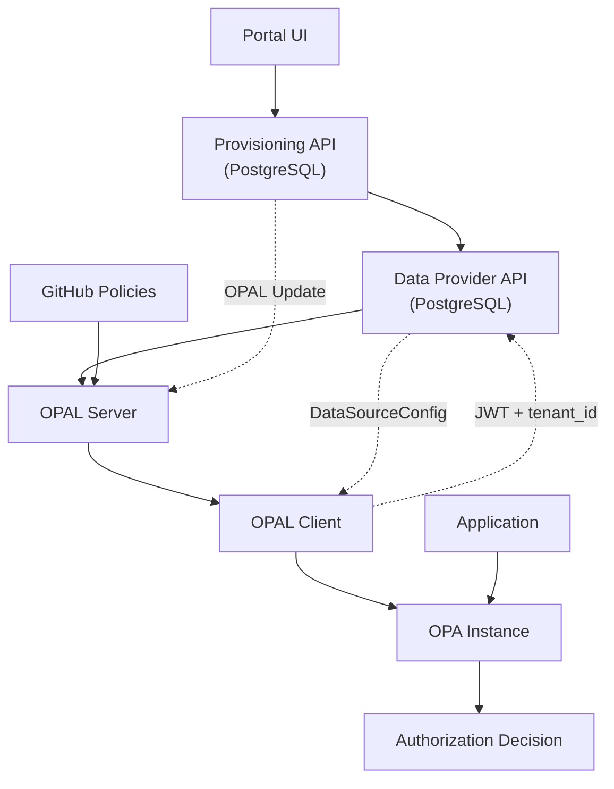

# OPA Zero Poll - Multi-Tenant Authorization System

**Proof of Concept** systemu autoryzacji opartego na **Open Policy Agent (OPA)** z architekturą **OPAL External Data Sources** dla środowisk multi-tenant.


## Problem i Rozwiązanie

W **dużych środowiskach enterprise z tysiącami tenantów**, standardowe mechanizmy synchronizacji danych z OPA są niewystarczające:

❌ **Pliki statyczne** - brak dynamicznej aktualizacji  
❌ **OPA Bundles** - problemy z skalowalnością przy tysiącach tenantów  
❌ **Standardowe OPAL External Data Sources** - brak per-tenant isolation  

✅ **Nasze rozwiązanie**: **Dynamiczne OPAL External Data Sources** z single topic multi-tenant i hierarchiczną izolacją, umożliwiające:
- **Per-tenant data isolation** bez zmian w kodzie
- **Skalowalne provisioning** nowych tenantów w runtime
- **Single topic multi-tenant** architecture dla tysięcy tenantów
- **Eliminację duplikacji danych** między systemami

---

## Architektura

### Komponenty

#### Data Provider API (Port 8110)
- **Flask** z integracją **PostgreSQL**
- Implementuje **OPAL External Data Sources** z JWT authentication
- Dostarcza **per-tenant DataSourceConfig** z single topic i hierarchicznym dst_path
- Obsługuje **Model 1** (legacy ACL) i **Model 2** (RBAC + REBAC-like)
- **Database integration** - eliminuje duplikację danych z Provisioning API

#### Provisioning API (Port 8010)
- **FastAPI** z **PostgreSQL RBAC/REBAC**
- **Kompletny provisioning tenantów**: Tenant → Firma → Administrator
- **Automatyczne uprawnienia Portal Administrator** (6 kluczowych uprawnień)
- **OPAL integration** z single topic multi-tenant publishing

#### OPA Standalone (Port 8181)
- **Policy engine** z hybrydowymi regułami RBAC + REBAC-like
- **Multi-tenant data isolation** przez hierarchiczne ścieżki `/acl/{tenant_id}`
- **High-performance authorization decisions**

#### OPAL Server (Port 7002)
- **Zarządzanie politykami** i External Data Sources configuration
- **PubSub channels** dla real-time updates
- **GitHub integration** dla policy management
- **Single topic multi-tenant** orchestration

#### OPAL Client (Port 7000)
- **OPAL External Data Sources flow** implementation
- **JWT-based tenant isolation** z automatycznym data retrieval
- **Real-time synchronizacja** danych z OPAL Server
- **Per-tenant DataSourceConfig** processing

### Model Uprawnień

#### Model 2: Hybrid RBAC + REBAC
- **Separacja ról aplikacyjnych** od dostępu do firm/zasobów
- **Teams** dla łatwego kopiowania wzorców uprawnień w dużych organizacjach
- **Additive permissions** (sumowanie uprawnień z różnych źródeł)
- **OR Logic** autoryzacji (dostęp przez dowolną ścieżkę)

**Struktura danych:**
- `roles`: Role aplikacyjne per użytkownik (np. `user42.fk = ["fk_admin"]`)
- `access`: Dostęp do firm per tenant (np. `user42.tenant125 = ["company1", "company2"]`)
- `teams`: Zespoły łączące role z firmami (np. `kadry.roles.hr = ["hr_editor"]`)
- `memberships`: Członkostwo w zespołach (np. `user99 = ["kadry"]`)
- `permissions`: Definicje uprawnień (np. `fk.fk_admin = ["view_entry", "edit_entry"]`)

### Tenant Isolation Mechanizm

**OPAL External Data Sources** z **single topic multi-tenant** i **hierarchiczną izolacją**:
1. **OPAL Client** wysyła JWT token do Data Provider API
2. **Data Provider API** waliduje token i ekstraktuje `tenant_id`
3. **Per-tenant DataSourceConfig** response z single topic `multi_tenant_data`
4. **Hierarchiczna izolacja** w dst_path: `/acl/{tenant_id}`
5. **OPA** otrzymuje dane w oddzielnych ścieżkach per tenant

### Architektura Flow



**Kluczowe przepływy:**
- **Provisioning**: Portal UI → Provisioning API → PostgreSQL → OPAL Server
- **Data Sync**: OPAL Client → Data Provider API (JWT) → PostgreSQL → OPA
- **Authorization**: Application → OPA → Decision

### Dokumentacja szczegółowa

- [docs/ARCHITECTURE.md](docs/ARCHITECTURE.md) – szczegółowa architektura systemu
- [docs/PORTAL_MANAGEMENT.md](docs/PORTAL_MANAGEMENT.md) – zarządzanie uprawnieniami w Portal Symfonia
- [docs/OPAL_DYNAMIC_MULTI_TENANT.md](docs/OPAL_DYNAMIC_MULTI_TENANT.md) – dynamiczne dodawanie tenantów i single topic multi-tenant
- [docs/model2-data-structure.md](docs/model2-data-structure.md) – specyfikacja Model 2
- [docs/model2-example-scenarios.md](docs/model2-example-scenarios.md) – przykłady użycia

---

## Quick Start

### 1. Instalacja Docker

Uruchom środowisko Docker:
```bash
cd new-architecture
docker-compose up -d
```

### 2. Sprawdzenie statusu serwisów

Sprawdź czy wszystkie serwisy są uruchomione:
```bash
# Health checks wszystkich komponentów
curl http://localhost:8110/health  # Data Provider API
curl http://localhost:8010/health  # Provisioning API  
curl http://localhost:8181/health  # OPA
curl http://localhost:7002/healthcheck  # OPAL Server
curl http://localhost:7000/healthcheck  # OPAL Client

# Status kontenerów
docker-compose ps
```

### 3. Wywołania API startowe

Sprawdź jakie dane mają serwisy na start:

```bash
# Data Provider API - lista tenantów (PostgreSQL)
curl http://localhost:8110/tenants

# Provisioning API - lista tenantów (PostgreSQL)  
curl http://localhost:8010/tenants

# OPA - sprawdź czy są jakieś dane (powinno być puste na start)
curl http://localhost:8181/v1/data/acl
```

**Oczekiwany rezultat**: Serwisy działają, ale **brak danych tenantów** na początku.

### 4. Sekwencja rejestracji tenanta

Wykonaj kompletny provisioning nowego tenanta:

```bash
# Provisioning kompletnej struktury tenanta (v2.0.0)
curl -X POST http://localhost:8010/provision-tenant \
  -H "Content-Type: application/json" \
  -d '{
    "tenant_id": "demo_tenant_123", 
    "tenant_name": "Demo Company Ltd",
    "admin_email": "admin@democompany.com",
    "admin_name": "Jan Kowalski"
  }'
```

**Oczekiwany rezultat**: Status 201 z kompletną strukturą tenanta.

### 5. Sprawdzenie logów serwera

Sprawdź w logach OPAL Server czy jest broadcast:
```bash
# Logi OPAL Server - szukaj "multi_tenant_data" topic
docker-compose logs opal-server | grep -i "multi_tenant_data\|broadcast\|publish"

# Logi OPAL Client - szukaj otrzymanych eventów
docker-compose logs opal-client | grep -i "data.*config\|fetch\|update"
```

**Oczekiwany rezultat**: 
- OPAL Server: broadcast event z topic `multi_tenant_data`
- OPAL Client: otrzymany event i wykonane żądanie do Data Provider API

### 6. Finalne sprawdzenie danych w OPA

Sprawdź czy dane tenanta są dostępne w OPA:

```bash
# Sprawdź dane tenanta w OPA
curl http://localhost:8181/v1/data/acl/demo_tenant_123

# Sprawdź listę wszystkich tenantów w OPA
curl http://localhost:8181/v1/data/acl

# Test autoryzacji dla nowego tenanta
curl "http://localhost:8181/v1/data/rbac/allow" \
  -H "Content-Type: application/json" \
  -d '{
    "input": {
      "user": "admin_demo_tenant_123", 
      "action": "manage_users", 
      "resource": "portal", 
      "tenant": "demo_tenant_123"
    }
  }'
```

**Oczekiwany rezultat**: 
- Dane tenanta dostępne w OPA pod `/acl/demo_tenant_123`
- Administrator ma uprawnienia Portal (6 uprawnień)
- Autoryzacja zwraca `{"result": true}` dla administratora

---

## Testy Jednostkowe

### Test kompletnego provisioning tenanta
```bash
# Zainstaluj zależności Python (jeśli potrzebne)
pip install psycopg2-binary requests

# Test provisioning API v2.0.0 z PostgreSQL
cd new-architecture
python test_complete_tenant_provisioning_v2.py
```

**Co testuje:**
- ✅ Provisioning API - kompletna struktura tenanta w PostgreSQL
- ✅ Data Provider API - synchronizacja z PostgreSQL  
- ✅ OPAL Server - data update event
- ✅ OPAL Client - fetch i load danych
- ✅ OPA - dane dostępne dla autoryzacji
- ✅ Administrator z uprawnieniami Portal (6 uprawnień)

### Testy komponentów
```bash
# Data Provider API
cd new-architecture/components/data-provider-api
python -m pytest tests/ -v

# Testy systemu
cd new-architecture/tests  
python test_full_system.py
```

### Test autoryzacji
```bash
# Model 1 (legacy ACL)
curl "http://localhost:8181/v1/data/rbac/allow" \
  -H "Content-Type: application/json" \
  -d '{"input": {"user": "user1", "action": "read", "resource": "document1", "tenant": "tenant1"}}'

# Model 2 (hybrid RBAC + REBAC)
curl "http://localhost:8110/v2/users/user42/permissions?app=fk&action=view_entry&company_id=company1&tenant_id=tenant125"
```

---

## Troubleshooting

### Instalacja Docker na różnych systemach

#### macOS (Apple Silicon M1/M2)

**Wymagania**: Docker Desktop z Apple Silicon support

**Potencjalne problemy**:
1. Sprawdź czy Docker Desktop ma włączone "Use Rosetta for x86/amd64 emulation"
2. Jeśli problemy z budowaniem, wymuś rebuild: `docker-compose build --no-cache`

#### macOS (Intel)

**Zmiana wymagana**: Zamień `platform: linux/arm64` na `platform: linux/amd64` w `docker-compose.yml`:

```yaml
services:
  data-provider-api:
    platform: linux/amd64  # ← Zmień z arm64 na amd64
```

#### Windows

**Wymagania**:
- Docker Desktop z WSL2
- Git for Windows lub WSL2 Ubuntu

**Zmiany w docker-compose.yml**:
```yaml
services:
  data-provider-api:
    platform: linux/amd64  # ← Użyj amd64 na Windows
```

**Potencjalne problemy**:
- **Mapowanie portów**: Sprawdź czy porty 8000, 8010, 8110, 8181, 7001, 7002 nie są zajęte
- **Ścieżki**: Używaj forward slashy (`/`) zamiast backslash (`\`) w ścieżkach

#### Linux (Ubuntu/Debian/RHEL)

**Zmiany w docker-compose.yml**:
```yaml
services:
  data-provider-api:
    platform: linux/amd64  # ← Usuń lub zmień na amd64
```

**Dodatkowe zależności**:
```bash
# Ubuntu/Debian
sudo apt update && sudo apt install docker.io docker-compose-plugin

# RHEL/CentOS/Fedora  
sudo dnf install docker docker-compose
```

### Instalacja zależności Python dla testów

```bash
# Podstawowe zależności dla testów
pip install psycopg2-binary requests

# Jeśli problemy z psycopg2 na macOS:
brew install postgresql
pip install psycopg2

# Jeśli problemy z psycopg2 na Ubuntu/Debian:
sudo apt-get install python3-dev libpq-dev
pip install psycopg2

# Alternatywnie - użyj psycopg2-binary:
pip install psycopg2-binary
```

### Sprawdzenie konfiguracji

Po dostosowaniu platformy, sprawdź czy wszystko działa:

```bash
# 1. Restart wszystkich kontenerów
docker-compose down
docker-compose up --build -d

# 2. Sprawdź status
docker-compose ps

# 3. Test health checków
curl http://localhost:8110/health
curl http://localhost:8010/health
curl http://localhost:8181/health
curl http://localhost:7002/healthcheck
curl http://localhost:7000/healthcheck
```

### Częste problemy

#### Problem z portami
```bash
# Sprawdź zajęte porty
netstat -tulpn | grep :8110
# lub na macOS
lsof -i :8110

# Zmień porty w docker-compose.yml jeśli zajęte:
ports:
  - "8111:8110"  # Użyj innego portu zewnętrznego
```

#### Problem z pamięcią
```bash
# Zwiększ zasoby Docker Desktop:
# Settings → Resources → Advanced
# RAM: minimum 4GB, zalecane 8GB
# Swap: minimum 2GB
```

#### Problem z logami
```bash
# Sprawdź logi konkretnego serwisu
docker-compose logs data-provider-api
docker-compose logs opal-server

# Sprawdź logi na żywo
docker-compose logs -f

# Sprawdź logi z ostatnich 100 linii
docker-compose logs --tail=100
```

#### Problem z bazą danych PostgreSQL
```bash
# Sprawdź status bazy danych
docker-compose logs postgres-db

# Test połączenia z bazą
docker-compose exec postgres-db psql -U opa_user -d opa_zero_poll -c "SELECT 1;"

# Reset bazy danych (UWAGA: usuwa wszystkie dane)
docker-compose down -v
docker-compose up -d
```

---

## Struktura Projektu

```
new-architecture/
├── components/
│   ├── data-provider-api/     # OPAL External Data Sources + Model 2
│   ├── provisioning-api/      # Tenant management (PostgreSQL)
│   ├── opa-standalone/        # Policy engine
│   ├── opal-server/          # Policy & data orchestration
│   └── opal-client/          # Data synchronization
├── docs/                     # Dokumentacja architektury
├── test_complete_tenant_provisioning_v2.py  # Test end-to-end
└── docker-compose.yml       # Orchestration
```

## Konfiguracja

### Zmienne środowiskowe:
```bash
# URLs (opcjonalne)
OPA_URL=http://opa-standalone:8181
PROVISIONING_API_URL=http://provisioning-api:8010
OPAL_SERVER_URL=http://opal-server:7002
DATA_PROVIDER_API_URL=http://data-provider-api:8110

# PostgreSQL (konfigurowane w docker-compose.yml)
DB_HOST=postgres-db
DB_PORT=5432
DB_NAME=opa_zero_poll
DB_USER=opa_user
DB_PASSWORD=opa_password
```
