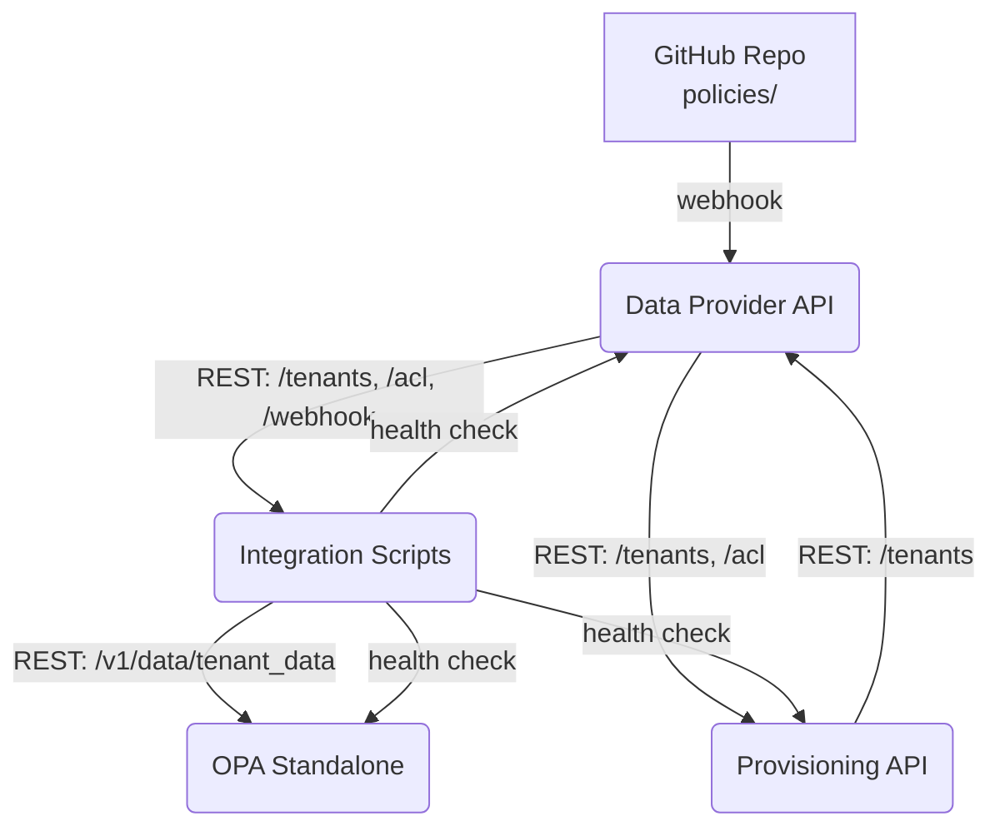

# ARCHITEKTURA SYSTEMU OPA ZERO POLL

## Cel projektu
Krótki opis celu systemu, np. "System do zarządzania politykami RBAC i autoryzacją oparty na OPA, bez OPAL."

---

## Diagram architektury

---

## Komponenty

### Data Provider API
- Flask, port 8110
- Dostarcza dane ACL dla tenantów
- Odbiera webhooki GitHub

### Provisioning API
- Flask, port 8010
- Zarządzanie tenantami

### OPA Standalone
- Port 8181
- Silnik autoryzacji z politykami Rego

### Integration Scripts
- Python
- Synchronizacja danych i polityk, obsługa webhooków

---

## Przepływ danych
1. Zmiana w repozytorium GitHub (policies/) wywołuje webhook
2. Data Provider API odbiera webhook, wykrywa zmiany w politykach
3. Integration Scripts synchronizuje dane i ładuje je do OPA
4. OPA Standalone udostępnia decyzje autoryzacyjne przez REST

---

## Uzasadnienia techniczne
- Brak OPAL: prostsza architektura, mniej zależności
- REST i webhooki: łatwa integracja, automatyzacja
- Mikroserwisy: łatwe testowanie, skalowanie

---

## Diagramy (opcjonalnie)
- Możesz dodać kolejne diagramy (np. sequence, flow) w mermaid

---

## FAQ / Notatki
- Tu możesz dodać odpowiedzi na najczęstsze pytania lub decyzje projektowe 