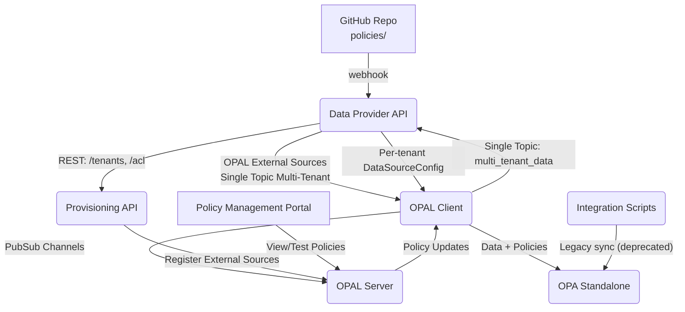

# ARCHITEKTURA SYSTEMU OPA ZERO POLL

## Cel projektu
System do zarządzania politykami RBAC i autoryzacją oparty na OPA, z integracją OPAL External Data Sources. **Serce systemu** stanowi mechanizm **single topic multi-tenant** z hierarchiczną izolacją per-tenant.

---

## Diagram architektury


```mermaid
graph TD
    A[GitHub Repo<br/>policies/] -- webhook --> B(Data Provider API)
    B -- "OPAL External Sources<br/>Single Topic Multi-Tenant" --> C(OPAL Client)
    C -- "Single Topic: multi_tenant_data" --> B
    B -- "Per-tenant DataSourceConfig" --> C
    C -- "PubSub Channels" --> D(OPAL Server)
    D -- "Policy Updates" --> C
    C -- "Data + Policies" --> E(OPA Standalone)
    B -- REST: /tenants, /acl --> F(Provisioning API)
    F -- "Register External Sources" --> D
    G(Integration Scripts) -- "Legacy sync (deprecated)" --> E
    H[Policy Management Portal] -- "View/Test Policies" --> D
```

---

## Komponenty

### Data Provider API - **KLUCZOWY KOMPONENT**
- Flask, port 8110
- **Implementuje Enhanced Model 1** - rozszerzoną strukturę RBAC z separacją per aplikacja
- **Implementuje OPAL External Data Sources API**
- **Obsługuje single topic multi-tenant** z hierarchiczną izolacją danych
- **Zwraca per-tenant DataSourceConfig** z odpowiednimi URL-ami i `dst_path`
- **Enhanced Model 1 Features:**
  - Roles per aplikacja: `user.roles.fk`, `user.roles.hr`, `user.roles.crm`
  - Permissions per aplikacja: `user.permissions.fk`, `user.permissions.hr`, `user.permissions.crm`
  - Companies w minimalnym formacie: tylko GUID arrays
  - Role definitions per aplikacja z odpowiednimi uprawnieniami
  - Pełna kompatybilność wsteczna z istniejącymi systemami
- Odbiera webhooki GitHub i przekierowuje do OPAL Server
- Orkiestruje synchronizację danych między systemami

### Provisioning API
- Flask, port 8010
- Zarządzanie tenantami i konfiguracja OPAL External Sources
- Rejestruje nowe data sources w OPAL Server

### OPA Standalone - **SILNIK DECYZYJNY**
- Port 8181
- Silnik autoryzacji z politykami Rego
- Otrzymuje dane i polityki od OPAL Client
- **Hierarchiczna izolacja tenantów** przez ścieżki `/acl/{tenant_id}`

### Integration Scripts (Legacy)
- Python, port 8000
- **DEPRECATED**: Zastąpione przez OPAL External Data Sources
- Synchronizacja danych i polityk (stara implementacja)

### OPAL Client - **SERCE SYNCHRONIZACJI**
- **Implementuje OPAL External Data Sources flow**
- **Subskrybuje single topic** `multi_tenant_data` dla wszystkich tenantów
- **Pobiera dane per-tenant** z Data Provider API z odpowiednimi URL-ami
- **Hierarchiczna izolacja** przez różne `dst_path`: `/acl/{tenant_id}`
- Synchronizuje dane z OPAL Server przez PubSub channels

### OPAL Server - **CENTRUM ZARZĄDZANIA**
- Zarządza politykami i External Data Sources configuration
- **Obsługuje PubSub channels (nie Kafka topics!)**
- Klonuje polityki z GitHub repository
- Publikuje aktualizacje do OPAL Client
- **Single topic multi-tenant** orchestration

### Policy Management Portal
- Next.js aplikacja zintegrowana z portalem Symfonia
- Przeglądanie, testowanie i monitorowanie polityk
- **NIE zawiera edycji** - polityki zarządzane przez Git/GitHub

---

## Przepływ danych - **MECHANIZM SINGLE TOPIC MULTI-TENANT**

### 1. **Dodanie nowego tenanta:**
```
Provisioning API → OPAL Server → Single Topic Event (multi_tenant_data)
                                ↓
                         OPAL Client (subscribed to multi_tenant_data)
```

### 2. **Pobieranie danych per-tenant:**
```
OPAL Client → Data Provider API (tenant-specific URL)
                           ↓
            Tenant Data Response
                           ↓
            OPAL Client → OPA (data update na dst_path: /acl/{tenant_id})
```

### 3. **Aktualizacja polityk:**
```
GitHub Webhook → Data Provider API → OPAL Server
                                   ↓
                            PubSub Channels
                                   ↓
                            OPAL Client → OPA
```

### 4. **Kluczowe mechanizmy:**
- **Single Topic Multi-Tenant**: jeden topic `multi_tenant_data` dla wszystkich tenantów
- **Hierarchiczna izolacja**: różne `dst_path` per tenant `/acl/{tenant_id}`
- **PubSub Channels**: real-time updates (nie Kafka!)
- **External Data Sources**: `OPAL_DATA_CONFIG_SOURCES` configuration
- **Dynamiczne dodawanie tenantów**: bez restartów OPAL Client

---

## Uzasadnienia techniczne

### **Single Topic Multi-Tenant vs Multiple Topics**
- **Skalowalność**: jeden topic dla tysięcy tenantów
- **Dynamiczne provisioning**: nowi tenanci bez restartu OPAL Client
- **Hierarchiczna izolacja**: przez `dst_path` w OPA zamiast osobne topics
- **Prostota**: eliminacja topic explosion problem

### **OPAL External Data Sources vs Kafka**
- **Hierarchiczna izolacja**: Bezpieczne, skalowalne, przez OPA paths
- **Per-tenant data sources**: Automatyczne przez różne URL i dst_path
- **OPAL native**: Wykorzystuje wbudowane mechanizmy OPAL
- **Prostota**: Standardowe HTTP API zamiast złożonej infrastruktury

### **Architektura mikroserwisów**
- **Data Provider API**: Centralne źródło danych enterprise
- **Provisioning API**: Zarządzanie cyklem życia tenantów
- **OPAL**: Zarządzanie politykami i synchronizacja
- **OPA**: Silnik decyzyjny autoryzacji z hierarchiczną izolacją

### **Real-time updates**
- **PubSub channels**: Natywny mechanizm OPAL
- **Single topic**: Wszystkie eventy tenantów na `multi_tenant_data`
- **Zero-polling**: Brak aktywnego odpytywania

---

## Konfiguracja OPAL External Data Sources

### **OPAL Client Environment:**
```bash
OPAL_DATA_TOPICS=multi_tenant_data
OPAL_SERVER_URL=http://opal-server:7002
```

### **Data Provider API Endpoints:**
```
GET /tenants/{tenant_id}/acl → Tenant-specific data
```

### **DataSourceConfig per Tenant (generowane dynamicznie):**
```json
{
  "entries": [
    {
      "url": "http://data-provider-api:8110/tenants/tenant125/acl",
      "topics": ["multi_tenant_data"],
      "dst_path": "/acl/tenant125"
    }
  ]
}
```

### **Single Topic Multi-Tenant Event:**
```json
{
  "entries": [
    {
      "url": "http://data-provider-api:8110/tenants/{tenant_id}/acl",
      "topics": ["multi_tenant_data"],
      "dst_path": "/acl/{tenant_id}"
    }
  ],
  "reason": "Load tenant {tenant_id} data"
}
```

---

## FAQ / Decyzje projektowe

### **Q: Dlaczego Single Topic Multi-Tenant zamiast osobnych topics per tenant?**
A: Single topic eliminuje "topic explosion problem" - jeden topic może obsłużyć tysiące tenantów. Izolacja jest zapewniona przez hierarchiczne ścieżki w OPA (`/acl/{tenant_id}`).

### **Q: Jak działa tenant isolation bez JWT?**
A: Przez hierarchiczne ścieżki w OPA. Każdy tenant ma dane w `/acl/{tenant_id}`, więc dane są naturalnie oddzielone. OPAL Client pobiera dane z różnych URL-i per tenant.

### **Q: Co się dzieje przy dodaniu nowego tenanta?**
A: Provisioning API wysyła event na topic `multi_tenant_data`, OPAL Client go odbiera i automatycznie pobiera dane dla nowego tenanta z odpowiedniego URL-a.

### **Q: Czy JWT authentication będzie dodane?**
A: JWT może być dodane w przyszłości jako **dodatkowa warstwa bezpieczeństwa dla całego OPAL Client**, ale nie jest konieczne dla basic tenant isolation, która działa przez hierarchiczne ścieżki.

### **Q: Czy Integration Scripts są nadal potrzebne?**
A: W docelowej architekturze NIE. Są zastąpione przez OPAL External Data Sources z single topic multi-tenant. Pozostają tylko dla legacy compatibility w POC.

### **Q: Czy Permission Event Translator został przetestowany?**
A: TAK. Subtask 40.3 ukończony pomyślnie 17 czerwca 2025. Szczegółowe testy dostępne w [PERMISSION_EVENT_TRANSLATOR_TESTS.md](./PERMISSION_EVENT_TRANSLATOR_TESTS.md). Translator poprawnie transluje eventy CREATE/DELETE użytkowników i współpracuje z politykami OPA. 