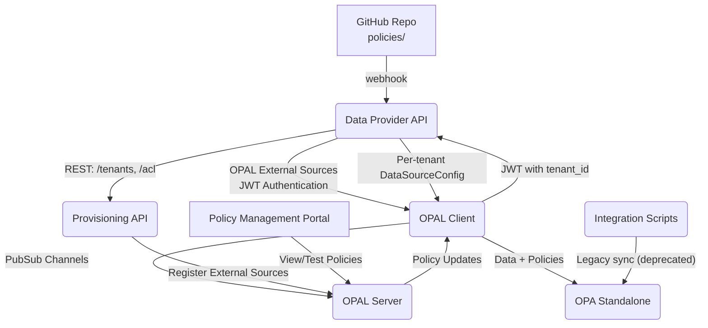

# ARCHITEKTURA SYSTEMU OPA ZERO POLL

## Cel projektu
System do zarządzania politykami RBAC i autoryzacją oparty na OPA, z integracją OPAL External Data Sources. **Serce systemu** stanowi mechanizm per-tenant data sources z JWT authentication.

---

## Diagram architektury



---

## Komponenty

### Data Provider API - **KLUCZOWY KOMPONENT**
- Flask, port 8110
- **Implementuje Enhanced Model 1** - rozszerzoną strukturę RBAC z separacją per aplikacja
- **Implementuje OPAL External Data Sources API**
- **Obsługuje JWT token authentication** dla per-tenant data isolation
- **Zwraca per-tenant DataSourceConfig na podstawie JWT claims**
- **Enhanced Model 1 Features:**
  - Roles per aplikacja: `user.roles.fk`, `user.roles.hr`, `user.roles.crm`
  - Permissions per aplikacja: `user.permissions.fk`, `user.permissions.hr`, `user.permissions.crm`
  - Companies w minimalnym formacie: tylko GUID arrays
  - Role definitions per aplikacja z odpowiednimi uprawnieniami
  - Pełna kompatybilność wsteczna z istniejącymi systemami
- Odbiera webhooki GitHub i przekierowuje do OPAL Server
- Orkiestruje synchronizację danych między systemami

### Provisioning API
- Flask, port 8010
- Zarządzanie tenantami i konfiguracja OPAL External Sources
- Rejestruje nowe data sources w OPAL Server

### OPA Standalone - **SILNIK DECYZYJNY**
- Port 8181
- Silnik autoryzacji z politykami Rego
- Otrzymuje dane i polityki od OPAL Client

### Integration Scripts (Legacy)
- Python, port 8000
- **DEPRECATED**: Zastąpione przez OPAL External Data Sources
- Synchronizacja danych i polityk (stara implementacja)

### OPAL Client - **SERCE SYNCHRONIZACJI**
- **Implementuje OPAL External Data Sources flow**
- **Wysyła JWT z tenant_id do Data Provider API**
- **Odbiera per-tenant DataSourceConfig** z odpowiednimi URL-ami
- Synchronizuje dane z OPAL Server przez PubSub channels

### OPAL Server - **CENTRUM ZARZĄDZANIA**
- Zarządza politykami i External Data Sources configuration
- **Obsługuje PubSub channels (nie Kafka topics!)**
- Klonuje polityki z GitHub repository
- Publikuje aktualizacje do OPAL Client

### Policy Management Portal
- Next.js aplikacja zintegrowana z portalem Symfonia
- Przeglądanie, testowanie i monitorowanie polityk
- **NIE zawiera edycji** - polityki zarządzane przez Git/GitHub

---

## Przepływ danych - **MECHANIZM OPAL EXTERNAL DATA SOURCES**

### 1. **Dodanie nowego tenanta:**
```
Provisioning API → OPAL Server → External Data Sources Config
                                ↓
                         OPAL Client (z OPAL_DATA_CONFIG_SOURCES)
```

### 2. **Pobieranie danych per-tenant:**
```
OPAL Client → Data Provider API (JWT validation + tenant_id extraction)
                           ↓
            Per-tenant DataSourceConfig Response
                           ↓
            OPAL Client → OPA (data update)
```

### 3. **Aktualizacja polityk:**
```
GitHub Webhook → Data Provider API → OPAL Server
                                   ↓
                            PubSub Channels
                                   ↓
                            OPAL Client → OPA
```

### 4. **Kluczowe mechanizmy:**
- **JWT Authentication**: tenant_id w custom claims
- **Per-tenant DataSourceConfig**: dynamiczne konfiguracje
- **PubSub Channels**: real-time updates (nie Kafka!)
- **External Data Sources**: `OPAL_DATA_CONFIG_SOURCES` configuration

---

## Uzasadnienia techniczne

### **OPAL External Data Sources vs Kafka**
- **JWT authentication**: Bezpieczne, skalowalne, standardowe
- **Per-tenant isolation**: Automatyczne przez JWT claims
- **OPAL native**: Wykorzystuje wbudowane mechanizmy OPAL
- **Prostota**: Standardowe HTTP API zamiast złożonej infrastruktury

### **Architektura mikroserwisów**
- **Data Provider API**: Centralne źródło danych enterprise
- **Provisioning API**: Zarządzanie cyklem życia tenantów
- **OPAL**: Zarządzanie politykami i synchronizacja
- **OPA**: Silnik decyzyjny autoryzacji

### **Real-time updates**
- **PubSub channels**: Natywny mechanizm OPAL
- **External Data Sources**: Dynamiczne konfiguracje per-tenant
- **Zero-polling**: Brak aktywnego odpytywania

---

## Konfiguracja OPAL External Data Sources

### **OPAL Client Environment:**
```bash
OPAL_DATA_CONFIG_SOURCES=http://data-provider-api:8110/data/config
OPAL_SERVER_URL=http://opal-server:7002
```

### **Data Provider API Endpoints:**
```
GET /data/config?token=<jwt> → Per-tenant DataSourceConfig
GET /tenants/{tenant_id}/acl → Tenant-specific data
```

### **JWT Structure:**
```json
{
  "tenant_id": "tenant125",
  "iat": 1640995200,
  "exp": 1640998800
}
```

### **DataSourceConfig Response:**
```json
{
  "entries": [
    {
      "url": "http://data-provider-api:8110/tenants/tenant125/acl",
      "config": {
        "headers": {"Authorization": "Bearer <jwt>"}
      },
      "save_method": "PUT",
      "dst_path": "/acl/tenant125"
    }
  ]
}
```

---

## FAQ / Decyzje projektowe

### **Q: Dlaczego OPAL External Data Sources zamiast Kafka?**
A: OPAL External Data Sources to natywny mechanizm OPAL, prostszy w implementacji i maintenance. Kafka byłby over-engineering dla tego use case.

### **Q: Jak działa tenant isolation?**
A: Przez JWT claims z tenant_id. OPAL Client wysyła JWT token, Data Provider API go waliduje i zwraca odpowiednie dane dla tenanta.

### **Q: Co się dzieje przy dodaniu nowego tenanta?**
A: Provisioning API rejestruje External Data Source w OPAL Server, który automatycznie konfiguruje OPAL Client do pobierania danych dla nowego tenanta.

### **Q: Czy Integration Scripts są nadal potrzebne?**
A: W docelowej architekturze NIE. Są zastąpione przez OPAL External Data Sources. Pozostają tylko dla legacy compatibility w POC. 