# DATABASE SCHEMA - OPA Zero Poll

## 📊 Entity Relationship Diagram (ERD)

```mermaid
erDiagram
    TENANTS {
        varchar tenant_id PK
        varchar tenant_name
        text description
        varchar status
        jsonb metadata
        timestamp created_at
        timestamp updated_at
    }

    USERS {
        varchar user_id PK
        varchar username UK
        varchar email
        varchar full_name
        varchar status
        jsonb metadata
        timestamp created_at
        timestamp updated_at
    }

    APPLICATIONS {
        varchar app_id PK
        varchar app_name UK
        text description
        varchar status
        jsonb metadata
        timestamp created_at
    }

    COMPANIES {
        varchar company_id PK
        varchar tenant_id FK
        varchar company_name
        varchar company_code
        text description
        varchar parent_company_id FK
        varchar status
        jsonb metadata
        timestamp created_at
        timestamp updated_at
    }

    ROLES {
        varchar role_id PK
        varchar role_name
        varchar app_id FK
        text description
        jsonb metadata
        timestamp created_at
    }

    PERMISSIONS {
        varchar permission_id PK
        varchar permission_name
        varchar app_id FK
        text description
        jsonb metadata
        timestamp created_at
    }

    PROFILES {
        varchar profile_id PK
        varchar profile_name
        varchar app_id FK
        text description
        jsonb metadata
        timestamp created_at
    }

    TEAMS {
        varchar team_id PK
        varchar team_name
        varchar tenant_id FK
        varchar team_type
        varchar status
        text description
        jsonb metadata
        timestamp created_at
        timestamp updated_at
    }

    USER_ROLES {
        varchar user_id FK
        varchar role_id FK
        timestamp created_at
    }

    PROFILE_ROLES {
        varchar profile_id FK
        varchar role_id FK
        timestamp created_at
    }

    USER_PROFILES {
        varchar user_id FK
        varchar profile_id FK
        timestamp created_at
    }

    USER_COMPANIES {
        varchar user_id FK
        varchar company_id FK
        timestamp created_at
    }

    USER_TEAMS {
        varchar user_id FK
        varchar team_id FK
        varchar role_type
        timestamp created_at
    }

    ROLE_PERMISSIONS {
        varchar role_id FK
        varchar permission_id FK
        timestamp created_at
    }



    TEAM_PROFILES {
        varchar team_id FK
        varchar profile_id FK
        timestamp created_at
    }

    TEAM_COMPANIES {
        varchar team_id FK
        varchar company_id FK
        timestamp created_at
    }

    %% Primary relationships
    TENANTS ||--o{ COMPANIES : "contains"
    COMPANIES ||--o{ COMPANIES : "parent-child"
    APPLICATIONS ||--o{ ROLES : "defines"
    APPLICATIONS ||--o{ PERMISSIONS : "defines"
    APPLICATIONS ||--o{ PROFILES : "defines"
    TENANTS ||--o{ TEAMS : "organizes"

    %% User relationships
    USERS ||--o{ USER_ROLES : "has"
    USERS ||--o{ USER_PROFILES : "assigned"
    USERS ||--o{ USER_COMPANIES : "accesses"
    USERS ||--o{ USER_TEAMS : "member_of"

    %% Role and Permission relationships
    ROLES ||--o{ USER_ROLES : "assigned_to"
    PROFILES ||--o{ USER_PROFILES : "assigned_to"
    COMPANIES ||--o{ USER_COMPANIES : "accessible_by"
    TEAMS ||--o{ USER_TEAMS : "includes"

    %% Permission mappings
    ROLES ||--o{ ROLE_PERMISSIONS : "grants"
    PERMISSIONS ||--o{ ROLE_PERMISSIONS : "granted_by"
    PROFILES ||--o{ PROFILE_ROLES : "maps_to"
    ROLES ||--o{ PROFILE_ROLES : "mapped_from"

    %% Team relationships
    TEAMS ||--o{ TEAM_PROFILES : "has"
    TEAMS ||--o{ TEAM_COMPANIES : "manages"
    PROFILES ||--o{ TEAM_PROFILES : "team_assigned"
    COMPANIES ||--o{ TEAM_COMPANIES : "team_managed"
```



---

## 🏗️ Główne Encje

### 📋 **TENANTS** - Dzierżawcy
**Opis**: Główne jednostki organizacyjne w systemie multi-tenant.

| Kolumna | Typ | Opis |
|---------|-----|------|
| `tenant_id` | varchar(50) PK | Unikalny identyfikator dzierżawcy |
| `tenant_name` | varchar(255) | Nazwa dzierżawcy |
| `description` | text | Opis dzierżawcy |
| `status` | varchar(20) | Status: active, inactive, suspended |
| `metadata` | jsonb | Dodatkowe dane konfiguracyjne |
| `created_at` | timestamp | Data utworzenia |
| `updated_at` | timestamp | Data ostatniej aktualizacji |

**Indeksy**: `tenant_name`, `status`

---

### 👤 **USERS** - Użytkownicy
**Opis**: Użytkownicy systemu z podstawowymi informacjami.

| Kolumna | Typ | Opis |
|---------|-----|------|
| `user_id` | varchar(50) PK | Unikalny identyfikator użytkownika |
| `username` | varchar(100) UK | Nazwa użytkownika (unikalna) |
| `email` | varchar(255) | Adres email |
| `full_name` | varchar(255) | Pełne imię i nazwisko |
| `status` | varchar(20) | Status: active, inactive, suspended |
| `metadata` | jsonb | Dodatkowe dane użytkownika |
| `created_at` | timestamp | Data utworzenia |
| `updated_at` | timestamp | Data ostatniej aktualizacji |

**Indeksy**: `username` (unique), `email`, `status`

---

### 🏢 **COMPANIES** - Firmy
**Opis**: Firmy w ramach dzierżawców, z hierarchią parent-child.

| Kolumna | Typ | Opis |
|---------|-----|------|
| `company_id` | varchar(50) PK | Unikalny identyfikator firmy |
| `tenant_id` | varchar(50) FK | Odniesienie do dzierżawcy |
| `company_name` | varchar(255) | Nazwa firmy |
| `company_code` | varchar(50) | Kod firmy (np. NIP) |
| `description` | text | Opis firmy |
| `parent_company_id` | varchar(50) FK | Firma nadrzędna (self-reference) |
| `status` | varchar(20) | Status: active, inactive |
| `metadata` | jsonb | Dodatkowe dane firmy |
| `created_at` | timestamp | Data utworzenia |
| `updated_at` | timestamp | Data ostatniej aktualizacji |

**Indeksy**: `tenant_id`, `parent_company_id`, `company_code`, `status`

---

### 📱 **APPLICATIONS** - Aplikacje
**Opis**: Aplikacje w systemie (FK, HR, CRM, eDeklaracje, etc.).

| Kolumna | Typ | Opis |
|---------|-----|------|
| `app_id` | varchar(50) PK | Unikalny identyfikator aplikacji |
| `app_name` | varchar(100) UK | Nazwa aplikacji (unikalna) |
| `description` | text | Opis aplikacji |
| `status` | varchar(20) | Status: active, inactive, development |
| `metadata` | jsonb | Konfiguracja aplikacji |
| `created_at` | timestamp | Data utworzenia |

**Indeksy**: `app_name` (unique), `status`

---

## 🔐 System Uprawnień

### 🎭 **ROLES** - Role
**Opis**: Role aplikacyjne definiujące zestawy uprawnień.

| Kolumna | Typ | Opis |
|---------|-----|------|
| `role_id` | varchar(50) PK | Unikalny identyfikator roli |
| `role_name` | varchar(100) | Nazwa roli |
| `app_id` | varchar(50) FK | Aplikacja do której należy rola |
| `description` | text | Opis roli |
| `metadata` | jsonb | Dodatkowe dane roli |
| `created_at` | timestamp | Data utworzenia |

**Indeksy**: `app_id`, `role_name`, `(app_id, role_name)` (composite unique)

---

### 🔑 **PERMISSIONS** - Uprawnienia
**Opis**: Atomowe uprawnienia w aplikacjach.

| Kolumna | Typ | Opis |
|---------|-----|------|
| `permission_id` | varchar(50) PK | Unikalny identyfikator uprawnienia |
| `permission_name` | varchar(100) | Nazwa uprawnienia |
| `app_id` | varchar(50) FK | Aplikacja do której należy uprawnienie |
| `description` | text | Opis uprawnienia |
| `metadata` | jsonb | Dodatkowe dane uprawnienia |
| `created_at` | timestamp | Data utworzenia |

**Indeksy**: `app_id`, `permission_name`, `(app_id, permission_name)` (composite unique)

---

### 📋 **PROFILES** - Profile
**Opis**: Predefiniowane zestawy uprawnień do szybkiego przypisywania.

| Kolumna | Typ | Opis |
|---------|-----|------|
| `profile_id` | varchar(50) PK | Unikalny identyfikator profilu |
| `profile_name` | varchar(100) | Nazwa profilu |
| `app_id` | varchar(50) FK | Aplikacja do której należy profil |
| `description` | text | Opis profilu |
| `metadata` | jsonb | Dodatkowe dane profilu |
| `created_at` | timestamp | Data utworzenia |

**Indeksy**: `app_id`, `profile_name`, `(app_id, profile_name)` (composite unique)

---

## 👥 System Zespołów

### 🏆 **TEAMS** - Zespoły
**Opis**: Zespoły grupujące użytkowników z podobnymi rolami i dostępem.

| Kolumna | Typ | Opis |
|---------|-----|------|
| `team_id` | varchar(50) PK | Unikalny identyfikator zespołu |
| `team_name` | varchar(255) | Nazwa zespołu |
| `tenant_id` | varchar(50) FK | Dzierżawca do którego należy zespół |
| `team_type` | varchar(50) | Typ: functional, project, department, external |
| `status` | varchar(20) | Status: active, inactive, archived |
| `description` | text | Opis zespołu |
| `metadata` | jsonb | Dodatkowe dane zespołu |
| `created_at` | timestamp | Data utworzenia |
| `updated_at` | timestamp | Data ostatniej aktualizacji |

**Indeksy**: `tenant_id`, `team_type`, `status`

---

## 🔗 Tabele Relacyjne

### **USER_ROLES** - Przypisania ról użytkownikom
- `user_id` + `role_id` → Composite PK
- Przypisuje role bezpośrednio użytkownikom

### **USER_PROFILES** - Przypisania profili użytkownikom  
- `user_id` + `profile_id` → Composite PK
- Szybkie przypisywanie zestawów uprawnień

### **USER_COMPANIES** - Dostęp użytkowników do firm
- `user_id` + `company_id` → Composite PK
- Określa do których firm użytkownik ma dostęp

### **USER_TEAMS** - Członkostwo w zespołach
- `user_id` + `team_id` → Composite PK
- `role_type`: leader, member, observer
- Członkostwo użytkowników w zespołach

### **ROLE_PERMISSIONS** - Mapowanie ról na uprawnienia
- `role_id` + `permission_id` → Composite PK
- Określa jakie uprawnienia zawiera dana rola

### **PROFILE_ROLES** - Mapowanie profili na role
- `profile_id` + `role_id` → Composite PK
- Określa jakie role zawiera dany profil

### **TEAM_PROFILES** - Profile zespołowe
- `team_id` + `profile_id` → Composite PK
- Profile przypisane do całego zespołu

### **TEAM_COMPANIES** - Firmy obsługiwane przez zespoły
- `team_id` + `company_id` → Composite PK
- Określa które firmy obsługuje dany zespół

---

## 📊 Kluczowe Relacje

### 🔄 **Hierarchia Firm**
```sql
-- Firma może mieć firmę nadrzędną
COMPANIES.parent_company_id → COMPANIES.company_id
```

### 👤 **Ścieżki Dostępu Użytkownika**

**1. Bezpośrednie Role:**
```
USERS → USER_ROLES → ROLES → ROLE_PERMISSIONS → PERMISSIONS
```

**2. Profile Aplikacyjne:**
```
USERS → USER_PROFILES → PROFILES → PROFILE_ROLES → ROLES → ROLE_PERMISSIONS → PERMISSIONS
```

**3. Zespoły (REBAC):**
```
USERS → USER_TEAMS → TEAMS → TEAM_PROFILES → PROFILES → PROFILE_ROLES → ROLES → ROLE_PERMISSIONS → PERMISSIONS
```

### 🏢 **Dostęp do Firm**

**1. Bezpośredni:**
```
USERS → USER_COMPANIES → COMPANIES
```

**2. Przez Zespoły:**
```
USERS → USER_TEAMS → TEAMS → TEAM_COMPANIES → COMPANIES
```

---

## 🚀 Performance & Indeksy

### **Główne Indeksy**
```sql
-- Przyspieszenie lookup użytkowników
CREATE INDEX idx_users_username ON users(username);
CREATE INDEX idx_users_status ON users(status);

-- Przyspieszenie autoryzacji
CREATE INDEX idx_user_roles_user ON user_roles(user_id);
CREATE INDEX idx_user_profiles_user ON user_profiles(user_id);
CREATE INDEX idx_user_companies_user ON user_companies(user_id);

-- Przyspieszenie zespołów
CREATE INDEX idx_user_teams_user ON user_teams(user_id);
CREATE INDEX idx_user_teams_team ON user_teams(team_id);

-- Przyspieszenie firm per tenant
CREATE INDEX idx_companies_tenant ON companies(tenant_id);
CREATE INDEX idx_companies_parent ON companies(parent_company_id);
```

### **Composite Indeksy**
```sql
-- Przyspieszenie aplikacyjnych lookup
CREATE UNIQUE INDEX idx_roles_app_name ON roles(app_id, role_name);
CREATE UNIQUE INDEX idx_permissions_app_name ON permissions(app_id, permission_name);
CREATE UNIQUE INDEX idx_profiles_app_name ON profiles(app_id, profile_name);
```

---

## 🔄 Migration Guidelines

### **Dodawanie Nowych Aplikacji**
1. Dodaj rekord do `APPLICATIONS`
2. Zdefiniuj `ROLES` dla aplikacji
3. Zdefiniuj `PERMISSIONS` dla aplikacji  
4. Utwórz `ROLE_PERMISSIONS` mappings
5. Opcjonalnie: Utwórz `PROFILES` z `PROFILE_PERMISSIONS`

### **Dodawanie Nowych Użytkowników**
1. Dodaj rekord do `USERS`
2. Przypisz dostęp do firm przez `USER_COMPANIES`
3. Przypisz role przez `USER_ROLES` lub profile przez `USER_PROFILES`
4. Opcjonalnie: Dodaj do zespołów przez `USER_TEAMS`

### **Struktura Multi-Tenant**
- Wszystkie dane są izolowane przez `tenant_id`
- Każdy tenant ma własne: `COMPANIES`, `TEAMS`
- Aplikacje (`APPLICATIONS`), role (`ROLES`), uprawnienia (`PERMISSIONS`) są globalne
- Użytkownicy (`USERS`) mogą mieć dostęp do wielu tenantów

---

## 🎯 Model Autoryzacji

### **Enhanced Model 1 (Aktualny)**
- Role per aplikacja: `user.roles.fk`, `user.roles.hr`
- Permissions per aplikacja: `user.permissions.fk`, `user.permissions.hr` 
- Companies: GUID arrays per user
- Backward compatibility z istniejącymi systemami

### **Model 2 (Przyszłość - Soft Fork)**
- Additive architecture: dodaje funkcjonalność zespołów
- Teams + memberships dla REBAC patterns
- OR logic: direct roles **LUB** team membership **LUB** resource relationships
- Zero risk deployment

---

**Data aktualizacji**: 2024-12-29  
**Wersja schematu**: Enhanced Model 1  
**Status**: Production Ready 