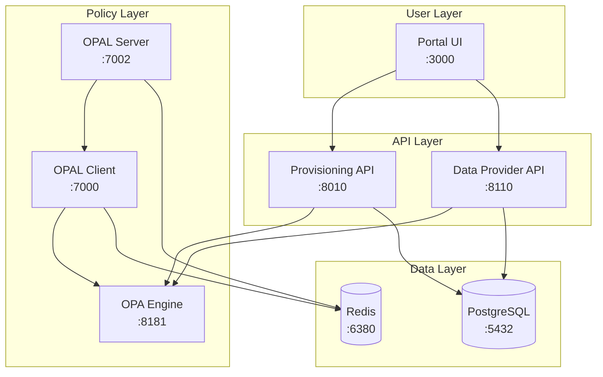

# 🚀 Deployment Guide - OPA Zero Poll POC

Kompletny przewodnik wdrożenia **OPA Zero Poll** POC na lokalnym komputerze.

## 📋 Spis treści

- [Szybki start](#-szybki-start)
- [Wymagania systemowe](#-wymagania-systemowe)
- [Architektura deployment](#-architektura-deployment)
- [Setup krok po kroku](#-setup-krok-po-kroku)
- [Konfiguracja środowisk](#-konfiguracja-środowisk)
- [Zarządzanie kontenerami](#-zarządzanie-kontenerami)
- [Monitoring i logowanie](#-monitoring-i-logowanie)
- [Troubleshooting](#-troubleshooting)
- [Produkcja](#-produkcja)

---

## ⚡ Szybki start

```bash
# 1. Sklonuj i przygotuj
git clone https://github.com/plduser/opa-zero-poll.git
cd opa-zero-poll

# 2. Automatyczny setup
./scripts/setup.sh

# 3. Weryfikacja
./scripts/verify.sh

# ✅ Gotowe! POC działa na localhost
```

**Czas setup:** ~5 minut | **Wymagania:** Docker, Git

---

## 📋 Wymagania systemowe

### **🖥️ Obsługiwane platformy**

| Platforma | Status | Uwagi |
|-----------|--------|-------|
| **macOS (Intel)** | ✅ Pełne wsparcie | `linux/amd64` |
| **macOS (Apple Silicon)** | ✅ Pełne wsparcie | `linux/arm64` |
| **Linux (Ubuntu/Debian)** | ✅ Pełne wsparcie | `linux/amd64` |
| **Linux (RHEL/CentOS)** | ✅ Pełne wsparcie | `linux/amd64` |
| **Windows 10/11** | ✅ Z Docker Desktop + WSL2 | `linux/amd64` |

### **🔧 Wymagane narzędzia**

| Narzędzie | Wersja | Wymagane | Uwagi |
|-----------|--------|----------|-------|
| **Docker** | 20.10+ | ✅ Tak | Docker Desktop zalecany |
| **Docker Compose** | 2.0+ | ✅ Tak | Wbudowany w Docker Desktop |
| **Git** | 2.20+ | ✅ Tak | Do pobrania repo |
| **curl** | Dowolna | ⚠️ Zalecane | Do testowania API |
| **Node.js** | 18+ | 🔧 Portal UI | Tylko dla Portal UI |
| **jq** | Dowolna | 🔧 Opcjonalne | Do parsowania JSON |

### **💾 Wymagania zasobów**

| Komponent | RAM | CPU | Disk | Uwagi |
|-----------|-----|-----|------|-------|
| **Minimalne** | 4GB | 2 cores | 10GB | Tylko backend |
| **Zalecane** | 8GB | 4 cores | 20GB | Backend + Portal UI |
| **PostgreSQL** | 512MB | 0.5 core | 2GB | Baza danych |
| **OPA + OPAL** | 1GB | 1 core | 1GB | Policy engine |
| **APIs** | 1GB | 1 core | 2GB | Data + Provisioning |
| **Portal UI** | 2GB | 1 core | 5GB | Next.js development |

### **🌐 Porty i sieć**

| Port | Serwis | Protokół | Dostęp |
|------|--------|----------|--------|
| **3000** | Portal UI | HTTP | Publiczny |
| **5432** | PostgreSQL | TCP | Prywatny |
| **6380** | Redis | TCP | Prywatny |
| **7000** | OPAL Client | HTTP | Prywatny |
| **7002** | OPAL Server | HTTP | Prywatny |
| **8010** | Provisioning API | HTTP | Publiczny |
| **8110** | Data Provider API | HTTP | Publiczny |
| **8181** | OPA Engine | HTTP | Publiczny |

---

## 🏗️ Architektura deployment

### **📦 Komponenty systemu**



### **🔄 Przepływ danych**

1. **Portal UI** → API calls → **Data Provider/Provisioning APIs**
2. **APIs** → Authorization checks → **OPA Engine**
3. **OPAL Server** → Policy sync → **OPAL Client** → **OPA Engine**
4. **APIs** → Data persistence → **PostgreSQL**
5. **OPAL** → Real-time updates → **Redis**

### **🐳 Docker Services**

| Service | Image | Build | Dependencies |
|---------|-------|-------|--------------|
| `postgres-db` | `postgres:13` | 🔸 Hub | None |
| `redis-broadcast` | `redis:7-alpine` | 🔸 Hub | None |
| `data-provider-api` | Custom | 🔨 Build | PostgreSQL |
| `provisioning-api` | Custom | 🔨 Build | PostgreSQL |
| `opa-standalone` | Custom | 🔨 Build | None |
| `opal-server` | `permitio/opal-server` | 🔸 Hub | Redis |
| `opal-client` | `permitio/opal-client` | 🔸 Hub | Redis, OPA |

---

## 🏃‍♂️ Setup krok po kroku

### **1. 📥 Przygotowanie środowiska**

```bash
# Sklonuj repozytorium
git clone https://github.com/plduser/opa-zero-poll.git
cd opa-zero-poll

# Sprawdź Docker
docker --version
docker-compose --version

# Sprawdź dostępne porty (opcjonalnie)
netstat -an | grep LISTEN | grep -E "3000|5432|6380|7000|7002|8010|8110|8181"
```

### **2. 🔧 Konfiguracja platformy**

#### **Automatyczna (zalecana)**
```bash
# Automatyczna detekcja i konfiguracja
./scripts/platform-detect.sh
```

#### **Ręczna (fallback)**
```bash
# macOS Apple Silicon (M1/M2/M3)
sed -i 's/platform: linux\/amd64/platform: linux\/arm64/g' docker-compose.yml

# macOS Intel / Linux / Windows
sed -i 's/platform: linux\/arm64/platform: linux\/amd64/g' docker-compose.yml
```

### **3. 🌍 Konfiguracja środowiska**

```bash
# Skopiuj template konfiguracji
cp env.template .env

# Edytuj konfigurację (opcjonalnie)
nano .env  # lub vim, vscode, itp.
```

**Kluczowe ustawienia w `.env`:**
```bash
# Hasło bazy danych
DB_PASSWORD=opa_password

# Webhook secret (zmień w produkcji!)
WEBHOOK_SECRET=twoj_super_tajny_klucz123!@#

# Tryb debug (wyłącz w produkcji)
DEBUG=false
```

### **4. 🚀 Uruchomienie pełnego stacku**

#### **Opcja A: Automatyczny setup (zalecana)**
```bash
# Kompletny setup z weryfikacją
./scripts/setup.sh

# Lub z dodatkowymi opcjami:
./scripts/setup.sh --verbose --clean --with-portal
```

#### **Opcja B: Manual setup**
```bash
# Uruchom kontener
docker-compose up -d

# Sprawdź status
docker-compose ps

# Sprawdź logi
docker-compose logs --tail=50
```

### **5. ✅ Weryfikacja deployment**

```bash
# Automatyczna weryfikacja
./scripts/verify.sh

# Szczegółowa diagnostyka
./scripts/verify.sh --detailed --test-tenant

# Szybka weryfikacja (tylko health checks)
./scripts/verify.sh --quick
```

### **6. 🎯 Test funkcjonalności**

```bash
# Test podstawowych endpointów
curl http://localhost:8110/health
curl http://localhost:8010/health
curl http://localhost:8181/health

# Utwórz test tenant
curl -X POST http://localhost:8010/provision-tenant \
  -H "Content-Type: application/json" \
  -d '{
    "tenant_id": "demo_company_123",
    "tenant_name": "Demo Company Ltd",
    "admin_email": "admin@democompany.com",
    "admin_name": "Jan Kowalski"
  }'

# Test autoryzacji
curl "http://localhost:8181/v1/data/rbac/allow" \
  -H "Content-Type: application/json" \
  -d '{
    "input": {
      "user": "admin_demo_company_123",
      "action": "manage_users",
      "resource": "portal",
      "tenant": "demo_company_123"
    }
  }'
```

### **7. 🌐 Portal UI (opcjonalnie)**

```bash
# Zainstaluj zależności Node.js
npm install

# Uruchom development server
npm run dev

# Portal dostępny na: http://localhost:3000
```

---

## 🔧 Konfiguracja środowisk

### **🏠 Development**

```bash
# Szybki setup dla rozwoju
./scripts/setup.sh --with-portal --verbose

# Live reload włączony
# Debug logi włączone
# Hot reloading Portal UI
```

**Cechy środowiska DEV:**
- ✅ Debug logi włączone
- ✅ JWT validation wyłączona
- ✅ Portal UI z hot reload
- ✅ Szybki restart kontenerów
- ✅ Volumes dla development

### **🧪 Testing**

```bash
# Setup dla testów
./scripts/setup.sh --clean

# Uruchom testy weryfikacyjne
./scripts/verify.sh --test-tenant --detailed
```

**Cechy środowiska TEST:**
- ✅ Wyczyścić dane przed testami
- ✅ Automatyczne tenant creation/cleanup
- ✅ Extended health checks
- ✅ Performance metrics
- ✅ Full API test coverage

### **🎯 Staging**

```bash
# Produkcyjny-like setup
DEBUG=false docker-compose up -d

# Monitoring włączony
# JWT validation włączona
# Ograniczenie logów
```

**Cechy środowiska STAGING:**
- ✅ Produkcyjne ustawienia
- ✅ JWT validation włączona
- ✅ Monitoring i metrics
- ✅ Load testing ready
- ✅ Security hardening

### **🏭 Production**

Zobacz sekcję [Produkcja](#-produkcja) poniżej.

---

## 📦 Zarządzanie kontenerami

### **🔄 Restart i zarządzanie**

```bash
# Restart wszystkich serwisów
./scripts/restart.sh

# Restart tylko backend (bez bazy)
./scripts/restart.sh --backend-only

# Restart z rebuild
./scripts/restart.sh --rebuild --clean

# Restart z verbose output
./scripts/restart.sh --verbose
```

### **📊 Monitoring kontenerów**

```bash
# Status wszystkich kontenerów
docker-compose ps

# Szczegółowe informacje
docker-compose ps --format "table {{.Service}}\t{{.Status}}\t{{.Ports}}\t{{.Image}}"

# Użycie zasobów
docker stats

# Logi w czasie rzeczywistym
docker-compose logs -f

# Logi konkretnego serwisu
docker-compose logs -f data-provider-api --tail=100
```

### **🔧 Operacje maintenance**

```bash
# Zatrzymaj wszystko
docker-compose stop

# Usuń kontener (zachowaj dane)
docker-compose down

# Usuń kontener + dane
docker-compose down -v

# Wyczyść nieużywane zasoby
docker system prune -a

# Backup bazy danych
docker exec postgres-db pg_dump -U opa_user opa_zero_poll > backup.sql

# Restore bazy danych
docker exec -i postgres-db psql -U opa_user -d opa_zero_poll < backup.sql
```

### **🚨 Emergency procedures**

```bash
# Force restart wszystkiego
docker-compose kill
docker-compose rm -f
docker-compose up -d

# Reset PostgreSQL (⚠️ UWAGA: usuwa dane!)
docker-compose stop postgres-db
docker volume rm $(docker volume ls -q | grep postgres)
docker-compose up -d postgres-db

# Reset Redis cache
docker-compose exec redis-broadcast redis-cli FLUSHALL
```

---

## 📊 Monitoring i logowanie

### **📈 Health checks**

```bash
# Automated health monitoring
watch -n 5 './scripts/verify.sh --quick'

# Manual endpoint checks
curl -s http://localhost:8110/health | jq .
curl -s http://localhost:8010/health | jq .
curl -s http://localhost:8181/health | jq .
curl -s http://localhost:7002/healthcheck | jq .
curl -s http://localhost:7000/healthcheck | jq .
```

### **📝 Logowanie**

```bash
# Wszystkie logi
docker-compose logs --tail=100

# Logi z timestampami
docker-compose logs -t --tail=100

# Logi tylko błędów
docker-compose logs --tail=100 | grep -i "error\|exception\|failed"

# Follow logs w czasie rzeczywistym
docker-compose logs -f data-provider-api provisioning-api

# Export logów do pliku
docker-compose logs --tail=1000 > logs/deployment_$(date +%Y%m%d_%H%M%S).log
```

### **🔍 Debugging**

```bash
# Wejście do kontenera
docker exec -it data-provider-api bash
docker exec -it postgres-db psql -U opa_user -d opa_zero_poll

# Sprawdź zmienne środowiskowe
docker exec data-provider-api env

# Sprawdź procesy w kontenerze
docker exec data-provider-api ps aux

# Sprawdź network connectivity
docker exec data-provider-api ping postgres-db
docker exec data-provider-api curl http://opa-standalone-new:8181/health
```

### **📊 Performance monitoring**

```bash
# Wykorzystanie zasobów
docker stats --format "table {{.Container}}\t{{.CPUPerc}}\t{{.MemUsage}}\t{{.NetIO}}"

# Disk usage
docker system df

# Sprawdź top procesy
docker exec data-provider-api top

# Database performance
docker exec postgres-db psql -U opa_user -d opa_zero_poll -c "
  SELECT 
    schemaname,
    tablename,
    n_tup_ins,
    n_tup_upd,
    n_tup_del 
  FROM pg_stat_user_tables;
"
```

---

## ❌ Troubleshooting

### **🐳 Docker problemy**

#### **Problem: Docker nie startuje**
```bash
# Sprawdź status Docker
docker info

# Restart Docker Desktop (macOS/Windows)
# Lub restart docker service (Linux):
sudo systemctl restart docker

# Sprawdź logi Docker
sudo journalctl -u docker.service --tail=50
```

#### **Problem: Kontener nie startuje**
```bash
# Sprawdź logi kontenera
docker-compose logs NAZWA_KONTENERA

# Sprawdź konfigurację
docker-compose config

# Sprawdź czy image istnieje
docker images | grep NAZWA_IMAGE

# Force rebuild
docker-compose build --no-cache NAZWA_SERWISU
docker-compose up -d NAZWA_SERWISU
```

#### **Problem: Port conflict**
```bash
# Znajdź proces zajmujący port
lsof -i :PORT_NUMBER

# Zatrzymaj proces
kill -9 PID

# Lub zmień port w docker-compose.yml
sed -i 's/OLD_PORT:CONTAINER_PORT/NEW_PORT:CONTAINER_PORT/g' docker-compose.yml
```

### **🌐 Networking problemy**

#### **Problem: Kontener nie może połączyć się z innym**
```bash
# Sprawdź network
docker network ls
docker network inspect opa_zero_poll_new-arch-network

# Test connectivity
docker exec KONTENER_A ping KONTENER_B
docker exec KONTENER_A nslookup KONTENER_B

# Restart network
docker-compose down
docker network prune
docker-compose up -d
```

#### **Problem: External API nie działa**
```bash
# Test z host machine
curl http://localhost:PORT/endpoint

# Test z innego kontenera
docker exec KONTENER curl http://DOCELOWY_KONTENER:PORT/endpoint

# Sprawdź firewall/proxy settings
```

### **🗄️ Database problemy**

#### **Problem: PostgreSQL nie startuje**
```bash
# Sprawdź logi
docker-compose logs postgres-db

# Sprawdź volume permissions
docker volume inspect $(docker volume ls -q | grep postgres)

# Reset PostgreSQL (⚠️ usuwa dane!)
docker-compose stop postgres-db
docker volume rm $(docker volume ls -q | grep postgres)
docker-compose up -d postgres-db
```

#### **Problem: Brak danych w bazie**
```bash
# Sprawdź czy init scripts się wykonały
docker exec postgres-db psql -U opa_user -d opa_zero_poll -c "\dt"

# Ręczne załadowanie danych
docker exec -i postgres-db psql -U opa_user -d opa_zero_poll < new-architecture/database/schema.sql
docker exec -i postgres-db psql -U opa_user -d opa_zero_poll < new-architecture/database/enhanced_seed_complete.sql
```

### **🔐 Policy/Authorization problemy**

#### **Problem: OPA nie ma polityk**
```bash
# Sprawdź czy polityki są załadowane
curl http://localhost:8181/v1/policies

# Sprawdź OPAL Server
curl http://localhost:7002/policy

# Sprawdź OPAL Client
curl http://localhost:7000/policy/data

# Ręczne załadowanie polityk
docker exec opa-standalone-new opa load /policies
```

#### **Problem: Authorization fails**
```bash
# Sprawdź dane w OPA
curl http://localhost:8181/v1/data

# Test konkretnej polityki
curl "http://localhost:8181/v1/data/rbac/allow" \
  -H "Content-Type: application/json" \
  -d '{"input": {"user": "test", "action": "read", "resource": "test", "tenant": "test"}}'

# Sprawdź logi OPA
docker-compose logs opa-standalone
```

### **🌐 Portal UI problemy**

#### **Problem: Portal nie startuje**
```bash
# Sprawdź Node.js version
node --version
npm --version

# Wyczyść cache
rm -rf node_modules package-lock.json
npm install

# Sprawdź port 3000
lsof -i :3000
```

#### **Problem: API calls fail z Portal**
```bash
# Sprawdź network z browser dev tools
# Sprawdź CORS headers
curl -H "Origin: http://localhost:3000" http://localhost:8110/health

# Sprawdź environment variables
cat .env | grep NEXT_PUBLIC
```

### **🏭 Performance problemy**

#### **Problem: Wolne API responses**
```bash
# Sprawdź load
docker stats

# Sprawdź database queries
docker exec postgres-db psql -U opa_user -d opa_zero_poll -c "
  SELECT query, calls, total_time, mean_time 
  FROM pg_stat_statements 
  ORDER BY total_time DESC LIMIT 10;
"

# Sprawdź OPA performance
curl http://localhost:8181/metrics
```

#### **Problem: High memory usage**
```bash
# Sprawdź memory per container
docker stats --format "table {{.Container}}\t{{.MemUsage}}\t{{.MemPerc}}"

# Ogranicz memory dla PostgreSQL
# Dodaj do docker-compose.yml:
# deploy:
#   resources:
#     limits:
#       memory: 1G
```

---

## 🏭 Produkcja

### **🔒 Security hardening**

#### **Environment variables**
```bash
# Ustaw silne hasła
DB_PASSWORD=$(openssl rand -base64 32)
WEBHOOK_SECRET=$(openssl rand -base64 32)

# Wyłącz debug mode
DEBUG=false
NODE_ENV=production

# Włącz JWT validation
DISABLE_JWT_VALIDATION=false
```

#### **Network security**
```bash
# Ograniczenia portów w docker-compose.yml (przykład):
# ports:
#   - "127.0.0.1:5432:5432"  # PostgreSQL tylko dla localhost
#   - "8110:8110"            # API publiczne
```

#### **SSL/TLS**
```bash
# Używaj reverse proxy (nginx/traefik) z SSL
# Przykład nginx config:
server {
    listen 443 ssl;
    server_name your-domain.com;
    
    ssl_certificate /path/to/cert.pem;
    ssl_certificate_key /path/to/key.pem;
    
    location /api/ {
        proxy_pass http://localhost:8110/;
    }
    
    location / {
        proxy_pass http://localhost:3000/;
    }
}
```

### **📊 Production monitoring**

#### **Health checks i alerting**
```bash
# Setup monitoring stack (opcjonalnie)
# docker-compose -f docker-compose.monitoring.yml up -d

# Custom health check script
#!/bin/bash
# health-check.sh
ENDPOINTS=(
    "http://localhost:8110/health"
    "http://localhost:8010/health"
    "http://localhost:8181/health"
)

for endpoint in "${ENDPOINTS[@]}"; do
    if ! curl -sf "$endpoint" > /dev/null; then
        echo "ALERT: $endpoint is down" | mail -s "OPA Zero Poll Alert" admin@company.com
    fi
done
```

#### **Log management**
```bash
# Logrotate configuration
# /etc/logrotate.d/docker-compose
/var/log/docker-compose/*.log {
    daily
    rotate 30
    compress
    delaycompress
    missingok
    notifempty
    create 644 root root
}

# Syslog integration
# docker-compose.yml:
# logging:
#   driver: syslog
#   options:
#     syslog-address: "tcp://your-log-server:514"
```

### **🔄 Backup i recovery**

#### **Database backup**
```bash
#!/bin/bash
# backup.sh
BACKUP_DIR="/backups/opa-zero-poll"
DATE=$(date +%Y%m%d_%H%M%S)

# Create backup
docker exec postgres-db pg_dump -U opa_user opa_zero_poll | gzip > "$BACKUP_DIR/backup_$DATE.sql.gz"

# Cleanup old backups (keep 30 days)
find "$BACKUP_DIR" -name "backup_*.sql.gz" -mtime +30 -delete
```

#### **Application state backup**
```bash
#!/bin/bash
# app-backup.sh
BACKUP_DIR="/backups/opa-zero-poll"
DATE=$(date +%Y%m%d_%H%M%S)

# Backup OPA policies
curl http://localhost:8181/v1/policies > "$BACKUP_DIR/policies_$DATE.json"

# Backup configuration
cp .env "$BACKUP_DIR/env_$DATE"
cp docker-compose.yml "$BACKUP_DIR/docker-compose_$DATE.yml"
```

### **⚡ Performance optimization**

#### **Database tuning**
```sql
-- postgresql.conf optimizations
shared_buffers = 1GB
effective_cache_size = 3GB
work_mem = 64MB
maintenance_work_mem = 256MB
max_connections = 200
```

#### **Container resource limits**
```yaml
# docker-compose.production.yml
version: '3.8'
services:
  postgres-db:
    deploy:
      resources:
        limits:
          memory: 2G
          cpus: '1'
        reservations:
          memory: 1G
          cpus: '0.5'
  
  data-provider-api:
    deploy:
      resources:
        limits:
          memory: 1G
          cpus: '0.5'
```

### **🚀 Deployment automation**

#### **CI/CD Pipeline example (GitHub Actions)**
```yaml
# .github/workflows/deploy.yml
name: Deploy OPA Zero Poll
on:
  push:
    branches: [main]

jobs:
  deploy:
    runs-on: ubuntu-latest
    steps:
      - uses: actions/checkout@v3
      
      - name: Deploy to production
        run: |
          ssh production-server '
            cd /opt/opa-zero-poll
            git pull origin main
            ./scripts/restart.sh --rebuild
            ./scripts/verify.sh --detailed
          '
```

#### **Blue-Green deployment**
```bash
#!/bin/bash
# blue-green-deploy.sh

# Start new version (green)
docker-compose -f docker-compose.green.yml up -d

# Health check
if ./scripts/verify.sh --quick; then
    # Switch traffic to green
    # Update load balancer config
    echo "Deployment successful"
    
    # Stop old version (blue)
    docker-compose -f docker-compose.blue.yml down
else
    echo "Deployment failed, rolling back"
    docker-compose -f docker-compose.green.yml down
    exit 1
fi
```

---

## 📞 Pomoc i wsparcie

### **📖 Dokumentacja**
- [QUICK_START.md](QUICK_START.md) - Szybki start
- [ARCHITECTURE.md](ARCHITECTURE.md) - Architektura systemu
- [DATABASE_SCHEMA.md](DATABASE_SCHEMA.md) - Struktura bazy danych
- [README.md](../README.md) - Główna dokumentacja

### **🛠️ Narzędzia diagnostyczne**
```bash
# Kompletna diagnostyka
./scripts/verify.sh --detailed --test-tenant

# Quick health check
./scripts/verify.sh --quick

# Platform detection
./scripts/platform-detect.sh

# System restart
./scripts/restart.sh --rebuild --clean
```

### **💬 Community i wsparcie**
- **GitHub Issues:** [Issues](https://github.com/plduser/opa-zero-poll/issues)
- **Pull Requests:** [PRs](https://github.com/plduser/opa-zero-poll/pulls)
- **Wiki:** [Documentation](https://github.com/plduser/opa-zero-poll/wiki)

### **🐛 Reporting problemów**

Gdy zgłaszasz problem, załącz:

1. **System info:**
```bash
uname -a
docker --version
docker-compose --version
```

2. **Logi:**
```bash
docker-compose logs --tail=100 > logs.txt
```

3. **Konfiguracja:**
```bash
docker-compose config > config.yml
```

4. **Stan systemu:**
```bash
./scripts/verify.sh --detailed > verification.txt
```

---

**🎉 Twój POC OPA Zero Poll jest gotowy do deployment!** 🚀

Dokumentacja stale aktualizowana → ostatnia aktualizacja: 2024 