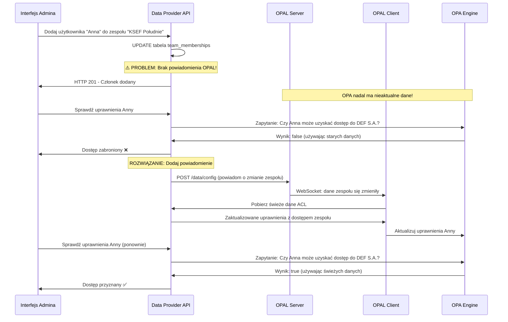

# Konfiguracja Single Topic Multi-Tenant dla OPAL

## Przegląd

Ten przewodnik przedstawia **niedokumentowany ale potężny wzorzec konfiguracji OPAL**, który umożliwia **zarządzanie danymi wielu tenantów bez konieczności restartowania OPAL Client** przy dodawaniu nowych tenantów.

### Odkrycie

Tradycyjna dokumentacja OPAL sugeruje używanie osobnych topic dla każdego tenanta:
```bash
# Tradycyjne podejście (wymaga restart dla nowych tenantów)
OPAL_DATA_TOPICS=tenant_1_data,tenant_2_data,tenant_3_data
```

Jednak dzięki obszernym testom odkryliśmy, że **jeden topic może obsługiwać wielu tenantów** z izolacją danych osiąganą przez różne wartości `dst_path`:

```bash
# Rewolucyjne podejście (BEZ konieczności restart dla nowych tenantów)
OPAL_DATA_TOPICS=tenant_data
```

## Jak to działa

### Architektura
1. **OPAL Server** otrzymuje eventy aktualizacji danych przez `POST /data/config`
2. **OPAL Server** publikuje eventy do pojedynczego topic `tenant_data`
3. **OPAL Client** (subskrybujący `tenant_data`) otrzymuje WSZYSTKIE eventy tenantów
4. **OPAL Client** pobiera dane z określonego URL
5. **OPAL Client** zapisuje dane w OPA pod określoną ścieżką `dst_path`
6. **Izolacja danych** jest osiągana przez hierarchiczne ścieżki w OPA

### Kluczowe korzyści
- ✅ **Nie wymaga restart** przy dodawaniu nowych tenantów
- ✅ **Dynamiczne dodawanie tenantów** w czasie rzeczywistym
- ✅ **Izolacja danych** przez hierarchię ścieżek OPA
- ✅ **Uproszczona konfiguracja** - jeden topic dla wszystkich tenantów
- ✅ **Nieograniczona skalowalność** - bez konieczności pre-konfiguracji topic

## Konfiguracja

### Konfiguracja OPAL Client
```yaml
environment:
  - OPAL_DATA_UPDATER_ENABLED=true
  - OPAL_DATA_TOPICS=tenant_data  # Pojedynczy topic dla wszystkich tenantów
```

### Eventy aktualizacji danych

Istnieją **dwa różne scenariusze** wysyłania eventów aktualizacji danych do OPAL Server:

#### 1. Początkowa rejestracja źródła danych (konfiguracja jednorazowa)
To dzieje się **raz na tenanta** podczas inicjalizacji systemu lub przy dodawaniu całkowicie nowego tenanta do systemu.

```bash
# Początkowa rejestracja dla tenant1 (tylko pierwszy raz)
curl -X POST http://localhost:7002/data/config \
  -H "Content-Type: application/json" \
  -d '{
    "entries": [{
      "url": "http://your-api:8090/acl/tenant1",
      "topics": ["tenant_data"],
      "dst_path": "/acl/tenant1"
    }],
    "reason": "Rejestracja źródła danych tenant1"
  }'

# Początkowa rejestracja dla tenant2 (BEZ KONIECZNOŚCI RESTART)
curl -X POST http://localhost:7002/data/config \
  -H "Content-Type: application/json" \
  -d '{
    "entries": [{
      "url": "http://your-api:8090/acl/tenant2", 
      "topics": ["tenant_data"],
      "dst_path": "/acl/tenant2"
    }],
    "reason": "Rejestracja źródła danych tenant2"
  }'
```

#### 2. Powiadomienia o zmianach danych (aktualizacje w czasie rzeczywistym)
To dzieje się **za każdym razem gdy dane się zmieniają** w ramach tenanta - wyzwalane przez eventy logiki biznesowej takie jak zmiany uprawnień użytkowników, przypisania ról, aktualizacje członkostwa w zespołach itp.

```bash
# Powiadomienie o zmianach uprawnień użytkownika w tenant1
curl -X POST http://localhost:7002/data/config \
  -H "Content-Type: application/json" \
  -d '{
    "entries": [{
      "url": "http://data-provider-api:8110/tenants/tenant1/acl",
      "topics": ["multi_tenant_data"],
      "dst_path": "/acl/tenant1",
      "config": {
        "tenant_id": "tenant1",
        "user_id": "user123",
        "action": "update",
        "change_type": "user",
        "timestamp": "2025-06-25T19:07:55.805802"
      }
    }],
    "reason": "Aktualizacja użytkownika: user123 w tenant tenant1"
  }'

# Powiadomienie o zmianach członkostwa w zespole
curl -X POST http://localhost:7002/data/config \
  -H "Content-Type: application/json" \
  -d '{
    "entries": [{
      "url": "http://data-provider-api:8110/tenants/tenant1/acl",
      "topics": ["multi_tenant_data"],
      "dst_path": "/acl/tenant1",
      "config": {
        "tenant_id": "tenant1",
        "team_id": "team_ksef_south",
        "action": "member_added",
        "change_type": "team",
        "timestamp": "2025-06-25T19:08:15.123456"
      }
    }],
    "reason": "Dodano członka zespołu do zespołu KSEF Południe w tenant1"
  }'

# Pełna resynchronizacja tenanta (gdy zachodzą większe zmiany)
curl -X POST http://localhost:7002/data/config \
  -H "Content-Type: application/json" \
  -d '{
    "entries": [{
      "url": "http://data-provider-api:8110/tenants/tenant1/acl",
      "topics": ["multi_tenant_full_sync"],
      "dst_path": "/acl/tenant1",
      "config": {
        "tenant_id": "tenant1",
        "action": "full_sync",
        "change_type": "full_sync",
        "timestamp": "2025-06-25T19:09:00.000000"
      }
    }],
    "reason": "Pełna synchronizacja tenanta: tenant1"
  }'
```

### Kiedy wyzwalane są powiadomienia o zmianach danych?

Przykłady z rzeczywistego systemu zarządzania uprawnieniami:

| **Event biznesowy** | **Przykład wyzwalacza** | **Powiadomienie OPAL** |
|-------------------|-------------------|---------------------|
| **Użytkownik dodany do zespołu** | Użytkownik "Anna" dołącza do zespołu "KSEF Południe" | `notify_user_change("tenant1", "user99", "update")` |
| **Zespół uzyskuje dostęp do firmy** | Zespół "KSEF Południe" uzyskuje dostęp do "DEF S.A." | `notify_user_change("tenant1", "affected_users", "update")` |
| **Rola przypisana użytkownikowi** | Użytkownik otrzymuje rolę "Administrator" w aplikacji KSEF | `notify_role_change("tenant1", "user123", {...}, "add_role")` |
| **Członek zespołu usunięty** | Użytkownik "Bob" usunięty z zespołu "KSEF Północ" | `notify_user_change("tenant1", "user456", "update")` |
| **Dostęp do firmy cofnięty** | Zespół traci dostęp do konkretnej firmy | `notify_user_change("tenant1", "team_members", "update")` |
| **Duża aktualizacja systemu** | Migracja bazy danych lub zmiany masowe | `sync_full_tenant("tenant1")` |

### Implementacja w kodzie aplikacji

```python
# Przykład: Po dodaniu użytkownika do zespołu
def add_team_member(team_id, user_id):
    # 1. Aktualizacja bazy danych
    db.execute("INSERT INTO team_memberships ...")
    db.commit()
    
    # 2. Powiadomienie OPAL o zmianie ⚠️ TO BRAKUJE W OBECNYM KODZIE!
    notify_user_change(tenant_id, user_id, "update")

# Przykład: Po nadaniu zespołowi dostępu do firmy  
def add_team_company(team_id, company_id):
    # 1. Aktualizacja bazy danych
    db.execute("INSERT INTO team_companies ...")
    db.commit()
    
    # 2. Powiadomienie OPAL o zmianach dla wszystkich członków zespołu
    team_members = get_team_members(team_id)
    for user_id in team_members:
        notify_user_change(tenant_id, user_id, "update")
```

### Wyjaśnienie procesu dwufazowego

**Faza 1: Rejestracja (jednorazowa)**
- OPAL Client dowiaduje się o nowym źródle danych
- OPAL Client subskrybuje zmiany dla tego tenanta
- Początkowe dane są pobierane i zapisywane w OPA

**Faza 2: Aktualizacje (ciągłe)**
- Logika biznesowa wyzwala zmiany danych 
- Aplikacja wywołuje API powiadomień OPAL
- OPAL Client ponownie pobiera zaktualizowane dane
- OPA otrzymuje świeże dane uprawnień
- Decyzje autoryzacji odzwierciedlają aktualny stan

**Kluczowa obserwacja:** Bez powiadomień Fazy 2, OPA będzie nadal używało nieaktualnych danych mimo że baza danych została zaktualizowana!

### Izolacja danych w OPA
Dane są przechowywane w OPA pod hierarchicznymi ścieżkami:
```
/acl/tenant1/users/[...]
/acl/tenant2/users/[...]
/acl/tenant3/users/[...]
```

## Kompletny przykład

### Konfiguracja Docker Compose
```yaml
version: '3.8'
services:
  opal-server:
    image: permitio/opal-server:latest
    environment:
      - OPAL_POLICY_REPO_URL=https://github.com/your-org/policies.git
    ports:
      - "7002:7002"

  opal-client:
    image: permitio/opal-client:latest
    environment:
      - OPAL_SERVER_URL=http://opal-server:7002
      - OPAL_DATA_UPDATER_ENABLED=true
      - OPAL_DATA_TOPICS=tenant_data  # Pojedynczy topic
    ports:
      - "7001:7001"
    depends_on:
      - opal-server

  opa:
    image: openpolicyagent/opa:latest-envoy
    ports:
      - "8181:8181"
    command:
      - "run"
      - "--server"
      - "--addr=0.0.0.0:8181"
      - "--diagnostic-addr=0.0.0.0:8282"
      - "--set=plugins.envoy_ext_authz_grpc.addr=:9191"
      - "--set=plugins.envoy_ext_authz_grpc.enable_reflection=true"
```

### Testowanie konfiguracji

1. **Uruchomienie serwisów:**
```bash
docker-compose up -d
```

2. **Dodanie danych tenant1:**
```bash
curl -X POST http://localhost:7002/data/config \
  -H "Content-Type: application/json" \
  -d '{
    "entries": [{
      "url": "http://your-data-api:8090/acl/tenant1",
      "topics": ["tenant_data"],
      "dst_path": "/acl/tenant1"
    }],
    "reason": "Załadowanie danych tenant1"
  }'
```

3. **Dodanie danych tenant2 (bez restart):**
```bash
curl -X POST http://localhost:7002/data/config \
  -H "Content-Type: application/json" \
  -d '{
    "entries": [{
      "url": "http://your-data-api:8090/acl/tenant2",
      "topics": ["tenant_data"], 
      "dst_path": "/acl/tenant2"
    }],
    "reason": "Załadowanie danych tenant2"
  }'
```

4. **Weryfikacja izolacji danych:**
```bash
# Sprawdzenie danych tenant1
curl http://localhost:8181/v1/data/acl/tenant1

# Sprawdzenie danych tenant2  
curl http://localhost:8181/v1/data/acl/tenant2
```

## Logi weryfikacyjne

Gdy działa prawidłowo, powinieneś zobaczyć logi takie jak:
```
OPAL Client:
INFO | Received notification of event: tenant_data
INFO | Updating policy data, reason: Załadowanie danych tenant1
INFO | Fetching data from url: http://your-data-api:8090/acl/tenant1
INFO | Saving fetched data to policy-store: destination path='/acl/tenant1'
DEBUG | processing store transaction: {'success': True, 'actions': ['set_policy_data']}
```

## Porównanie z tradycyjnym podejściem

| Aspekt | Tradycyjne Multi-Topic | Single Topic (ten przewodnik) |
|--------|------------------------|---------------------------|
| **Konfiguracja** | `OPAL_DATA_TOPICS=tenant_1_data,tenant_2_data,tenant_3_data` | `OPAL_DATA_TOPICS=tenant_data` |
| **Dodawanie nowego tenanta** | Wymaga restart OPAL Client | Bez konieczności restart |
| **Skalowalność** | Ograniczona przez pre-skonfigurowane topic | Nieograniczona |
| **Izolacja danych** | Oparta na topic | Oparta na ścieżkach w OPA |
| **Złożoność** | Wysoka (zarządzanie topic) | Niska (pojedynczy topic) |
| **Dodawanie w czasie rzeczywistym** | ❌ Nie | ✅ Tak |

## Ważne uwagi

### Subskrypcja topic jest statyczna
- Subskrypcja topic OPAL Client (`OPAL_DATA_TOPICS`) jest ustawiana przy starcie
- Nie można dynamicznie dodawać nowych topic bez restart
- Dlatego podejście single-topic jest rewolucyjne

### Wymagania data provider
- Twoje API data provider musi mieć endpointy dla każdego tenanta
- Przykład: `/acl/tenant1`, `/acl/tenant2`, `/acl/tenant3`
- Każdy endpoint powinien zwracać dane specyficzne dla tenanta

### Kwestie bezpieczeństwa
- Wszyscy OPAL Client subskrybujący `tenant_data` będą otrzymywać wszystkie eventy
- Izolacja danych polega na hierarchii ścieżek OPA
- Upewnij się, że twój data provider implementuje właściwą izolację tenantów

## Rozwiązywanie problemów

### OPAL Client nie otrzymuje eventów
1. Sprawdź subskrypcję topic: `docker exec opal-client env | grep OPAL_DATA_TOPICS`
2. Zweryfikuj logi OPAL Server dla publikacji eventów
3. Upewnij się o połączeniu WebSocket między client a server

### Dane się nie ładują
1. Zweryfikuj że endpoint data provider istnieje i zwraca prawidłowy JSON
2. Sprawdź logi OPAL Client dla błędów pobierania
3. Potwierdź że `dst_path` jest prawidłowo określona

### Konflikty danych
1. Upewnij się że różni tenanci używają różnych wartości `dst_path`
2. Zweryfikuj że data provider zwraca dane specyficzne dla tenanta
3. Sprawdź strukturę danych OPA: `curl http://localhost:8181/v1/data`

## Dlaczego to nie jest udokumentowane

Ten wzorzec działa ponieważ:
1. **OPAL Server** publikuje eventy do topic bez walidacji klientów
2. **OPAL Client** przetwarza wszystkie eventy dla subskrybowanych topic
3. **Izolacja danych** dzieje się na poziomie storage OPA, nie na poziomie topic
4. **Filtrowanie topic** służy tylko do subskrypcji, nie do izolacji danych

Dokumentacja OPAL skupia się na tradycyjnym podejściu multi-topic, ale nie eksploruje tego bardziej elastycznego wzorca single-topic.

## Przykład z rzeczywistego świata: Uprawnienia oparte na zespołach

Ten przykład pokazuje jak wzorzec single-topic obsługuje złożone scenariusze uprawnień opartych na zespołach w produkcji:

### Scenariusz: Użytkownik uzyskuje dostęp przez członkostwo w zespole



### Przykład kodu: Brakująca vs. naprawiona implementacja

**❌ Obecna implementacja (brakujące powiadomienia):**
```python
def add_team_member(team_id, user_id):
    """Obecny kod - TYLKO UPDATE, BEZ SYNCHRONIZACJI OPAL"""
    cursor.execute("""
        INSERT INTO team_memberships (user_id, team_id, role_in_team, joined_by)
        VALUES (%s, %s, %s, %s)
    """, (user_id, team_id, "member", "admin"))
    conn.commit()
    
    # ⚠️ BRAKUJE: Brak powiadomienia OPAL!
    return {"message": "Członek zespołu dodany pomyślnie"}
```

**✅ Naprawiona implementacja (z powiadomieniami):**
```python
def add_team_member(team_id, user_id):
    """Naprawiony kod - UPDATE + SYNCHRONIZACJA OPAL"""
    cursor.execute("""
        INSERT INTO team_memberships (user_id, team_id, role_in_team, joined_by)
        VALUES (%s, %s, %s, %s)
    """, (user_id, team_id, "member", "admin"))
    conn.commit()
    
    # ✅ NAPRAWIONE: Powiadom OPAL o zmianach uprawnień
    team_data = get_team_details(team_id)
    tenant_id = team_data["tenant_id"]
    
    # Powiadom o zmianie uprawnień użytkownika
    notify_user_change(tenant_id, user_id, "update")
    
    # Opcjonalne: Powiadom o zmianie składu zespołu
    notify_team_change(tenant_id, team_id, "member_added")
    
    return {"message": "Członek zespołu dodany pomyślnie"}

def notify_team_change(tenant_id, team_id, action):
    """Funkcja pomocnicza dla powiadomień specyficznych dla zespołu"""
    data = {
        "entries": [{
            "url": f"{DATA_PROVIDER_API_URL}/tenants/{tenant_id}/acl",
            "topics": ["multi_tenant_data"],
            "dst_path": f"/acl/{tenant_id}",
            "config": {
                "tenant_id": tenant_id,
                "team_id": team_id,
                "action": action,
                "change_type": "team",
                "timestamp": datetime.utcnow().isoformat()
            }
        }],
        "reason": f"Zespół {action}: {team_id} w tenant {tenant_id}"
    }
    return user_data_sync._send_opal_notification(data, "team_update", tenant_id)
```

### Wyniki testów produkcyjnych

**Przed naprawą (problem nieaktualnych danych):**
- ✅ Baza danych: Anna ma dostęp do DEF S.A. przez zespół
- ❌ Zapytanie OPA: `false` - Anna nie może uzyskać dostępu do DEF S.A.
- ❌ UI: Zakładki KSEF nie pojawiają się dla Anny

**Po naprawie (z powiadomieniami):**
- ✅ Baza danych: Anna ma dostęp do DEF S.A. przez zespół  
- ✅ Zapytanie OPA: `true` - Anna może uzyskać dostęp do DEF S.A.
- ✅ UI: Zakładki KSEF pojawiają się prawidłowo dla Anny

### Endpointy wymagające napraw

Na podstawie analizy kodu, te endpointy modyfikują dane zespołów ale nie powiadamiają OPAL:

| **Endpoint** | **Funkcja** | **Brakujące powiadomienie** |
|-------------|-------------|-------------------------|
| `POST /api/teams/<id>/members` | `add_team_member()` | `notify_user_change()` dla dodanego użytkownika |
| `DELETE /api/teams/<id>/members/<user>` | `remove_team_member()` | `notify_user_change()` dla usuniętego użytkownika |
| `POST /api/teams/<id>/companies` | `add_team_company()` | `notify_user_change()` dla wszystkich członków zespołu |
| `DELETE /api/teams/<id>/companies` | `remove_team_company()` | `notify_user_change()` dla wszystkich członków zespołu |
| `POST /api/teams/<id>/applications` | `add_team_application()` | `notify_user_change()` dla wszystkich członków zespołu |
| `DELETE /api/teams/<id>/applications` | `remove_team_application()` | `notify_user_change()` dla wszystkich członków zespołu |

## Wnioski

Konfiguracja single-topic multi-tenant to **przełomowe podejście** dla wdrożeń OPAL, które potrzebują:
- Dynamicznego dodawania tenantów bez przestoju
- Uproszczonego zarządzania konfiguracją  
- Nieograniczonej skalowalności
- Aktualizacji danych wielu tenantów w czasie rzeczywistym

Ten wzorzec jest gotowy do produkcji i został pomyślnie przetestowany z wieloma tenantami i aktualizacjami danych w czasie rzeczywistym.

## Wkład

Ten wzorzec konfiguracji został odkryty dzięki obszernym testom i badaniom. Jeśli uznasz to za przydatne, rozważ:
1. ⭐ Oznaczenie gwiazdką repozytorium OPAL
2. 💬 Podzielenie się swoim doświadczeniem w dyskusjach OPAL
3. 📝 Wniesienie ulepszeń do tej dokumentacji

---

*Ten przewodnik reprezentuje odkrycie społeczności, które rozszerza możliwości multi-tenant OPAL poza to, co jest obecnie udokumentowane.* 